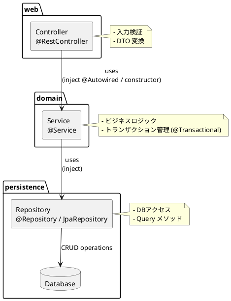

# Architecture

## Application Type

- backend
  - Java
    - Web Application
    - API Application
      - REST API Application
      - gRPC API Application
    - Job Application
      - Job Type
        - Tasklet Job Application
        - Chunk Job Application
      - Boot Type
        - Console Job Application
        - JMS Message Consumer Job Application

  - Go
    - Function Application
      - SQS
      - Lambda
      - Event Bridge
      - Step Function

- frontend
  - flutter
  - Next.js

## Application Type

## Component

- Controllerのインターフェイスは、Apiとして、OpenAPI Generatorで、自動生成する。
  - リソースのCRUDなど関連のあるAPIは、１まとめにする。

- 1連の画面遷移につき、1つのコントローラとする。
  - 登録（入力、確認、完了）
  - 更新（入力、確認、完了）
  - 検索、一覧表示、一括削除
  - 詳細表示、削除
  - 共通画面は、JavaScriptにて、画面内に表示する。

## Service

- １つのControllerクラスとに対して、１つのServiceクラスを対応させる。

## Repository

- テーブル構造に対応したEntityクラス、標準CRUDのRepositoryインターフェースは、自動生成する。
  - 標準CRUDのRepositoryインターフェースは、MyBatisの@Mapperとして実装する。
  - 標準CRUDのRepositoryインターフェースは、親インターフェースのdefaulメソッドで、楽観排他を実装する。

- 個別のSQLは、Serviceクラスごとに、MyBatisの@MapperのRepositoryインターフェースを実装する。
  - 入力は、Parameter。出力は、Result。
