# 『Design Patterns: Elements of Reusable Object-Oriented Software』

<!-- markdownlint-disable MD024 -->
<!-- markdownlint-disable MD029 -->

## 目次

### 1. 生成に関するパターン（Creational Patterns）- 5種類

オブジェクトの生成（インスタンス化）に関する仕組みを提供するパターンです。

1. **Abstract Factory**（関連する一連のインスタンスを、具体的なクラスを指定せずに生成する）
2. **Builder**（複合オブジェクトの組み立て工程を分離し、異なる表現を作成できるようにする）
3. **Factory Method**（インスタンスの生成をサブクラスに任せる）
4. **Prototype**（既存のインスタンスをコピーして新しいインスタンスを作る）
5. **Singleton**（あるクラスのインスタンスが、システム内にただ一つであることを保証する）

---

### 2. 構造に関するパターン（Structural Patterns）- 7種類

クラスやオブジェクトを組み合わせて、より大きな構造を作るためのパターンです。

6. **Adapter**（互換性のないインターフェースを適合させてつなげる）
7. **Bridge**（機能の階層と実装の階層を切り離して、それぞれ独立に拡張できるようにする）
8. **Composite**（容器と中身を同一視し、再帰的な構造（木構造）を扱う）
9. **Decorator**（オブジェクトに機能を動的に追加していく）
10. **Facade**（複雑な窓口を一つにまとめ、シンプルなインターフェースを提供する）
11. **Flyweight**（インスタンスを共有することで、メモリ使用量を節約する）
12. **Proxy**（本物のオブジェクトの身代わり（代理人）を立ててアクセスを制御する）

---

### 3. 振る舞いに関するパターン（Behavioral Patterns）- 11種類

オブジェクト間の通信や、アルゴリズムの責任分担に関するパターンです。

13. **Chain of Responsibility**（複数のオブジェクトを鎖状につなぎ、要求を次々に渡して処理する）
14. **Command**（命令をオブジェクトとして表現し、履歴の管理や再実行を可能にする）
15. **Interpreter**（独自の言語や構文を解析して実行する）
16. **Iterator**（集合体の中身を、その実装を意識させずに順番にスキャンする）
17. **Mediator**（オブジェクト間の複雑な調整を行う「仲裁役」を置く）
18. **Memento**（オブジェクトの状態を保存し、後で元に戻せるようにする）
19. **Observer**（状態が変化したときに、関連するオブジェクトへ自動的に通知する）
20. **State**（状態をクラスとして表現し、状態によって振る舞いを切り替える）
21. **Strategy**（アルゴリズムを切り替え可能にする）
22. **Template Method**（処理の枠組みを親クラスで決め、具体的な内容は子クラスで実装する）
23. **Visitor**（データ構造と、その上で行う処理を分離する）

## 詳細

### 1. Singleton (シングルトン)

#### 1. Pattern Name and Classification

* **名称：** Singleton（シングルトン）
* **分類：** 生成に関するパターン（Creational）

#### 2. Intent（意図）

あるクラスに対してインスタンスが**ただ一つ**しか存在しないことを保証し、それに対するグローバルなアクセスポイントを提供すること。

#### 3. Also Known As（別名）

なし

#### 4. Motivation（動機）

システムの中で、共通の資源を管理するオブジェクト（例：データベース接続プール、ログ記録用オブジェクト、設定情報管理クラス）は、複数のインスタンスが存在すると、状態の不整合が起きたり、メモリの無駄遣いになったりします。
Singletonパターンを使うことで、プログラムのどこから呼び出されても、常に「同じインスタンス」が返されるように強制できます。

#### 5. Applicability（適用可能性）

* クラスのインスタンスが厳密に1つだけでなければならず、それが共通の窓口からアクセス可能である必要がある場合。
* その唯一のインスタンスが、サブクラス化によって拡張可能であり、利用側がコードを修正することなく拡張されたインスタンスを使用できるようにしたい場合。

#### 6. Structure（構造）

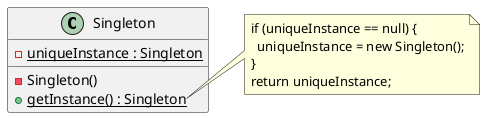

#### 7. Participants（参加者）

* **Singleton:**
  * 自分自身の唯一のインスタンスを保持するための静的（static）変数を定義する。
  * コンストラクタを `private` にし、外部からの新規生成を禁止する。
  * 唯一のインスタンスを取得するための静的メソッド（例：`getInstance()`）を提供する。

#### 8. Collaborations（協力作用）

クライアントは、Singletonクラスの静的メソッドを通じてのみ、インスタンスにアクセスします。

#### 9. Consequences（結果）

* **メリット:**
  * **アクセス制御:** 唯一のインスタンスへのアクセスを厳密に制御できる。
  * **名前空間の節約:** グローバル変数による汚染を避けられる。
  * **継承による柔軟性:** Singletonを継承して機能を変更することが可能。
* **デメリット:**
  * **テストの困難さ:** グローバルな状態を持つため、単体テストでインスタンスをモック（偽物）に差し替えるのが難しい。
  * **マルチスレッドの問題:** 実装を誤ると、複数のスレッドから同時にアクセスされた際に、複数のインスタンスが生成されてしまう可能性がある（同期制御が必要）。

#### 10. Implementation（実装）

* **コンストラクタの隠蔽:** 必ず `private` にする。
* **遅延初期化（Lazy Initialization）:** 必要になるまでインスタンスを作らない手法。
* **スレッドセーフ:** Javaでは `enum` を使う方法や、`Initialization-on-demand holder idiom` が推奨される。

#### 11. Sample Code（Java）

```java
public class Singleton {
    // 唯一のインスタンスを保持する。
    // staticな内部クラスを使うことでスレッドセーフかつ遅延初期化を実現
    private static class Holder {
        private static final Singleton INSTANCE = new Singleton();
    }

    // コンストラクタをprivateにして外部からのnewを禁止
    private Singleton() {
        System.out.println("インスタンスを生成しました。");
    }

    // 唯一のインスタンスを返す
    public static Singleton getInstance() {
        return Holder.INSTANCE;
    }

    public void showMessage() {
        System.out.println("Singletonインスタンスからのメッセージです。");
    }
}

// 利用側
public class Main {
    public static void main(String[] args) {
        Singleton s1 = Singleton.getInstance();
        Singleton s2 = Singleton.getInstance();

        if (s1 == s2) {
            System.out.println("s1とs2は同じインスタンスです。");
        }
    }
}
```

#### 12. Known Uses（実例）

* `java.lang.Runtime#getRuntime()`
* `java.awt.Desktop#getDesktop()`
* Spring Framework などのDIコンテナにおけるデフォルトのBeanスコープ。

#### 13. Related Patterns（関連するパターン）

* **Abstract Factory, Builder, Prototype:** これら自体がSingletonとして実装されることが多い。
* **Facade:** システムに1つだけ存在すれば良いため、Singletonにされることが多い。

### 2. Factory Method (ファクトリメソッド)

#### 1. Pattern Name and Classification

* **名称：** Factory Method（ファクトリメソッド）
* **分類：** 生成に関するパターン（Creational）

#### 2. Intent（意図）

オブジェクトを生成するためのインターフェースを定義しますが、実際にどのクラスをインスタンス化するかはサブクラスに決定させます。Factory Methodを使うことで、クラスのインスタンス化をサブクラス側に委ねる（延期する）ことができます。

#### 3. Also Known As（別名）

* Virtual Constructor（仮想コンストラクタ）

#### 4. Motivation（動機）

あるフレームワークを開発しているとします。そのフレームワーク内では「ドキュメント」を管理しますが、フレームワーク側では、具体的に「テキストドキュメント」なのか「画像ドキュメント」なのかを知ることはできません。
このとき、ドキュメントを作成するメソッド（工場）だけを抽象的に定義しておき、具体的な中身はフレームワークを利用するユーザーが作るサブクラスで定義することで、フレームワーク本体を書き換えることなく新しい種類のドキュメントに対応できるようになります。

#### 5. Applicability（適用可能性）

* クラスが、自分が生成しなければならないオブジェクトの具体的なクラスを予測できない場合。
* クラスが、その生成するオブジェクトの責任を、特定のサブクラスに委ねたい場合。
* 生成されるオブジェクトの型に関する知識を一箇所に集約し、プログラム全体に具体的なクラス名が散らばるのを防ぎたい場合。

#### 6. Structure（構造）

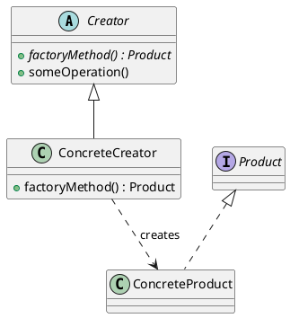

#### 7. Participants（参加者）

* **Product:** 生成されるオブジェクトのインターフェース。
* **ConcreteProduct:** Productインターフェースを実際に実装する具体的なクラス。
* **Creator:** `factoryMethod`（インスタンスを生成するメソッド）を宣言する。通常、Product型のオブジェクトを返す。
* **ConcreteCreator:** `factoryMethod` をオーバーライドして、具体的な `ConcreteProduct` のインスタンスを返す。

#### 8. Collaborations（協力作用）

`Creator` クラスは、具体的なインスタンスが必要になったとき、自分自身の `factoryMethod` を呼び出します。実際にはサブクラス（`ConcreteCreator`）がそのメソッドを実装しているため、正しい具体的な製品（`ConcreteProduct`）が生成されます。

#### 9. Consequences（結果）

* **メリット:**
  * **疎結合:** 利用側（Creator）は、生成される具体的なクラス名（ConcreteProduct）を知る必要がなく、インターフェースだけを知っていればよい。
  * **拡張性:** 新しい製品を追加したい場合、既存のコードを変更せずに、新しいサブクラスを作るだけで対応できる（開閉原則の遵守）。
* **デメリット:**
  * **クラス数の増加:** 1つの製品クラスを作るたびに、その生成用のサブクラス（ConcreteCreator）も作る必要があり、クラスの総数が増えてしまう。

#### 10. Implementation（実装）

* **抽象メソッドとしての定義:** `Creator` が `factoryMethod` を抽象メソッドとして定義し、必ずサブクラスに実装させる。
* **デフォルト実装の提供:** `Creator` がデフォルトの生成処理を持っておき、必要に応じてサブクラスで上書きさせる。
* **パラメータ化:** 引数によって生成するオブジェクトの種類を切り替える実装方法もある。

#### 11. Sample Code（Java）

```java
// Product
interface Logger {
    void log(String message);
}

// ConcreteProduct A
class FileLogger implements Logger {
    public void log(String message) { System.out.println("ファイルに記録: " + message); }
}

// ConcreteProduct B
class ConsoleLogger implements Logger {
    public void log(String message) { System.out.println("コンソールに記録: " + message); }
}

// Creator
abstract class LoggerFactory {
    // これが Factory Method
    public abstract Logger createLogger();

    // 生成したオブジェクトを利用する共通処理
    public void logMessage(String message) {
        Logger logger = createLogger();
        logger.log(message);
    }
}

// ConcreteCreator A
class FileLoggerFactory extends LoggerFactory {
    public Logger createLogger() { return new FileLogger(); }
}

// ConcreteCreator B
class ConsoleLoggerFactory extends LoggerFactory {
    public Logger createLogger() { return new ConsoleLogger(); }
}

// 利用側
public class Main {
    public static void main(String[] args) {
        LoggerFactory factory = new FileLoggerFactory();
        factory.logMessage("ハロー、デザインパターン！");
    }
}
```

#### 12. Known Uses（実例）

* `java.util.Collection#iterator()`: 具象クラス（ArrayListなど）が、適切なIterator（ConcreteProduct）を返す。
* Spring Framework の `BeanFactory`。
* JDBCの `Connection` オブジェクトを生成する各種ドライバ。

#### 13. Related Patterns（関連するパターン）

* **Abstract Factory:** Factory Method を複数まとめたような形になることが多い。
* **Template Method:** Factory Method は、Template Method パターンの特殊な形態（生成に特化したもの）と言える。
* **Prototype:** 生成するオブジェクトをサブクラス化ではなく「複製」で作る場合に比較検討される。

### 3. Abstract Factory (抽象的な工場)

#### 1. Pattern Name and Classification

* **名称：** Abstract Factory（アブストラクトファクトリ）
* **分類：** 生成に関するパターン（Creational）

#### 2. Intent（意図）

互いに関連したり、依存し合ったりする一連のオブジェクト群を、その具体的なクラスを明示せずに生成するためのインターフェースを提供します。

#### 3. Also Known As（別名）

* Kit（キット）

#### 4. Motivation（動機）

例えば、マルチプラットフォーム（WindowsとMac）に対応したGUIライブラリを考えてみましょう。「ボタン」や「チェックボックス」といった部品は、OSごとに見た目や挙動が異なります。
もしコードの中で `new WindowsButton()` と直接記述してしまうと、Mac版への切り替えが困難になります。Abstract Factoryを使えば、「部品を作る工場」自体を抽象化し、実行時に「Windows工場」か「Mac工場」かを1つ選ぶだけで、それ以降に生成されるすべての部品（ボタン、テキストなど）をそのOS専用のセットで統一できます。

#### 5. Applicability（適用可能性）

* システムが、製品がどのように生成、構成、表現されるかから独立している必要がある場合。
* システムを、複数の製品ファミリー（例：Windows用部品セットとMac用部品セット）のいずれか1つで構成したい場合。
* 関連する一連の製品オブジェクトが一緒に使用されるように設計されており、この制約を強制する必要がある場合。
* 製品のクラスライブラリを提供し、その実装ではなくインターフェースだけを公開したい場合。

#### 6. Structure（構造）

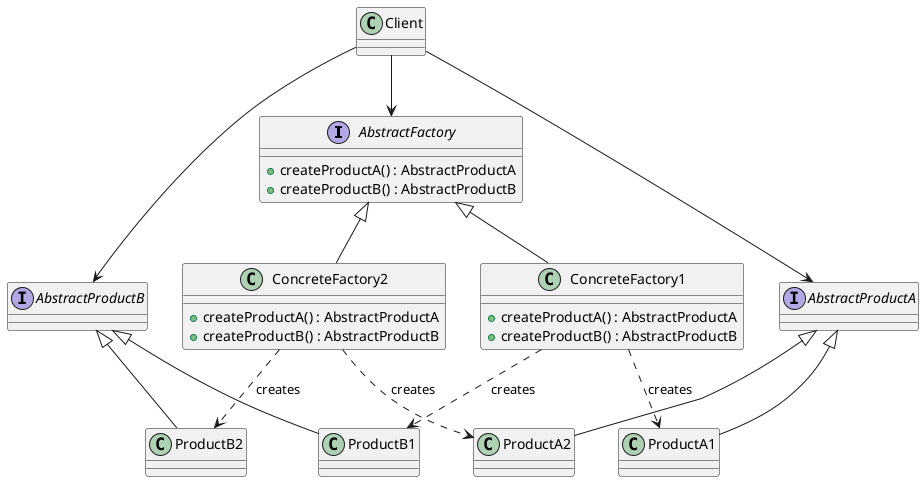

#### 7. Participants（参加者）

* **AbstractFactory:** 抽象的な製品を生成する操作のインターフェースを宣言する。
* **ConcreteFactory:** 具体的な製品を生成する操作を実装する。
* **AbstractProduct:** 製品オブジェクトの型ごとのインターフェースを宣言する。
* **ConcreteProduct:** 対応する ConcreteFactory によって生成される具体的な製品。
* **Client:** AbstractFactory と AbstractProduct インターフェースのみを使用して作業を行う。

#### 8. Collaborations（協力作用）

* 通常、実行時に `ConcreteFactory` のインスタンスが1つ作成されます。
* クライアントは、製品が必要になると工場に作成を依頼します。
* 工場は、その工場に対応した「一連の製品（ファミリー）」のインスタンスを返します。

#### 9. Consequences（結果）

* **メリット:**
  * **具体的なクラスの分離:** クライアントが具体的なクラス名を知る必要がないため、結合度が低くなる。
  * **製品の一貫性:** 同じ工場の製品を必ず使うようになるため、製品間の不整合（例：Windows用ボタンとMac用スクロールバーが混在する）を防げる。
  * **製品ファミリーの交換が容易:** 工場のインスタンスを入れ替えるだけで、アプリケーション全体の見た目や挙動を一度に変更できる。
* **デメリット:**
  * **新しい種類の製品追加が困難:** AbstractFactory のインターフェース自体を修正する必要があるため、すべての具体的な工場クラスを書き直さなければならない。

#### 10. Implementation（実装）

* **Singletonとしての工場:** 通常、特定の製品ファミリーを作る工場はシステムに1つあれば良いため、Singletonとして実装されることが多い。
* **Factory Methodとの組み合わせ:** 具体的な製品を作る各メソッド（`createProductA`など）は、内部で Factory Method パターンとして実装される。

#### 11. Sample Code（Java）

```java
// Abstract Products
interface Button { void paint(); }
interface Checkbox { void paint(); }

// Abstract Factory
interface GUIFactory {
    Button createButton();
    Checkbox createCheckbox();
}

// Concrete Products (Windows)
class WindowsButton implements Button {
    public void paint() { System.out.println("Windows風ボタンを描画"); }
}
class WindowsCheckbox implements Checkbox {
    public void paint() { System.out.println("Windows風チェックボックスを描画"); }
}

// Concrete Factory (Windows)
class WindowsFactory implements GUIFactory {
    public Button createButton() { return new WindowsButton(); }
    public Checkbox createCheckbox() { return new WindowsCheckbox(); }
}

// Concrete Products (Mac)
class MacButton implements Button {
    public void paint() { System.out.println("Mac風ボタンを描画"); }
}

// Concrete Factory (Mac)
class MacFactory implements GUIFactory {
    public Button createButton() { return new MacButton(); }
    public Checkbox createCheckbox() { return new WindowsCheckbox(); // 共通化も可能
    }
}

// Client
class Application {
    private Button button;
    public Application(GUIFactory factory) {
        this.button = factory.createButton();
    }
    public void paint() { button.paint(); }
}

public class Main {
    public static void main(String[] args) {
        // OSの設定等に応じて工場を切り替える
        GUIFactory factory = new WindowsFactory(); 
        Application app = new Application(factory);
        app.paint();
    }
}
```

#### 12. Known Uses（実例）

* Java Swing の `LookAndFeel` クラス。
* 各種OS向けGUIツールキット（Qt, wxWidgets など）。
* データベースアクセスライブラリ（特定のDB（MySQL/PostgreSQLなど）専用の接続・コマンド・リーダーのセットを生成する）。

#### 13. Related Patterns（関連するパターン）

* **Factory Method:** Abstract Factory は複数の Factory Method を持ったものと見なせる。
* **Singleton:** Concrete Factory は Singleton になることが多い。
* **Prototype:** 工場が製品を作る際、クラスから生成するのではなく、プロトタイプ（ひな形）をコピーして作るように実装することもできる。

### 4. Builder (建築者)

#### 1. Pattern Name and Classification

* **名称：** Builder（ビルダー）
* **分類：** 生成に関するパターン（Creational）

#### 2. Intent（意図）

複合オブジェクトの「作成過程」と「その表現（内部構造）」を分離します。これにより、同じ作成過程で異なる内部構造を持つオブジェクトを生成できるようにすることを目的とします。

#### 3. Also Known As（別名）

なし

#### 4. Motivation（動機）

例えば、多機能な「文書コンバータ」を作る場合を考えます。RTF（Rich Text Format）ファイルを読み込み、それを「HTML」や「PDF」、「プレーンテキスト」など様々な形式に変換したいとします。
このとき、「RTFを解析して各要素（テキスト、フォント変更、画像など）を取り出す手順」は共通ですが、「それらをどう組み合わせて最終的なファイルを作るか」は形式ごとに異なります。Builderパターンを使えば、解析器（Director）が建築者（Builder）に「次はテキストを作れ」「次は画像を追加しろ」と命令するだけで、具体的な出力形式を意識せずに複雑なオブジェクトを組み立てられます。

#### 5. Applicability（適用可能性）

* 複合オブジェクトの作成アルゴリズムが、そのオブジェクトを構成する部品群や、それらの組み立て方法から独立している必要がある場合。
* 作成過程において、作成されるオブジェクトに異なる表現（内部構造）を持たせる必要がある場合。
* 生成したいオブジェクトが非常に多くのパラメータを持ち、特にその組み合わせが複雑な場合。

#### 6. Structure（構造）

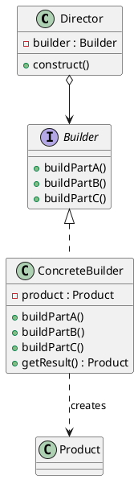

#### 7. Participants（参加者）

* **Builder:** 製品（Product）の各部品を作成するための抽象インターフェースを定義する。
* **ConcreteBuilder:** Builderインターフェースを実装し、部品を組み立て、最終的な製品を保持する。製品を取り出すためのメソッド（`getResult`）を持つ。
* **Director:** Builderのインターフェースを使って、オブジェクトを構築する「手順」を制御する。
* **Product:** 建設される複雑なオブジェクト。

#### 8. Collaborations（協力作用）

1. クライアントは `ConcreteBuilder` オブジェクトを作成し、それを `Director` に渡す。
2. `Director` は `Builder` のメソッドを特定の順番で呼び出し、製品を組み立てる。
3. 組み立てが終わると、クライアントは `ConcreteBuilder` から最終的な `Product` を受け取る。

#### 9. Consequences（結果）

* **メリット:**
  * **製品の内部表現を変更可能:** `Director` のコードを変えずに、新しい `Builder` を追加するだけで異なる製品を作れる。
  * **作成と表現の分離:** 複雑な構築コードをカプセル化できるため、`Director` は「手順」にのみ専念できる。
  * **作成プロセスの細かな制御:** 工場系パターンと違い、製品を「一気に」作るのではなく「ステップバイステップ」で作るため、構築過程をより詳細に制御できる。
* **デメリット:**
  * **Builderごとに製品が異なる場合の共通化:** Builderが作る製品（Product）が互いに全く異なる場合、共通のインターフェースを持たせることが難しくなる（Abstract Factoryとの違い）。

#### 10. Implementation（実装）

* **組み立てメソッドの戻り値:** 各 `buildPart` メソッドが自分自身（`this`）を返すようにすると、メソッドチェーン（`builder.addA().addB()`）による記述が可能になる（現代的な流儀）。
* **抽象クラスかインターフェースか:** デフォルトの挙動がない場合はインターフェース、共通の処理がある場合は抽象クラスにする。

#### 11. Sample Code（Java）

```java
// Product
class House {
    private String walls;
    private String roof;
    public void setWalls(String walls) { this.walls = walls; }
    public void setRoof(String roof) { this.roof = roof; }
    public void show() { System.out.println("家を建てました: " + walls + ", " + roof); }
}

// Builder
interface HouseBuilder {
    void buildWalls();
    void buildRoof();
    House getResult();
}

// ConcreteBuilder
class LuxuryHouseBuilder implements HouseBuilder {
    private House house = new House();
    public void buildWalls() { house.setWalls("大理石の壁"); }
    public void buildRoof() { house.setRoof("金色の屋根"); }
    public House getResult() { return house; }
}

// Director
class Architect {
    public void construct(HouseBuilder builder) {
        builder.buildWalls();
        builder.buildRoof();
    }
}

// Client
public class Main {
    public static void main(String[] args) {
        Architect architect = new Architect();
        HouseBuilder builder = new LuxuryHouseBuilder();
        
        architect.construct(builder); // 手順を実行
        House house = builder.getResult(); // 結果を取得
        house.show();
    }
}
```

#### 12. Known Uses（実例）

* `java.lang.StringBuilder#append()` （簡易的なBuilder）
* `java.util.stream.Stream.Builder`
* Lombokライブラリの `@Builder` アノテーション
* Apache などの設定ファイル生成ライブラリ

#### 13. Related Patterns（関連するパターン）

* **Abstract Factory:** 同様に複雑なオブジェクトを作るが、Builderは「手順（ステップ）」を重視し、Abstract Factoryは「製品ファミリーの統一」を重視する。
* **Composite:** Builderが最終的に構築する製品が、Composite構造（木構造）になることがよくある。

### 5. Prototype (原型)

#### 1. Pattern Name and Classification

* **名称：** Prototype（プロトタイプ）
* **分類：** 生成に関するパターン（Creational）

#### 2. Intent（意図）

生成すべきオブジェクトの種類を「原型のインスタンス」によって特定し、その原型をコピー（複製）することで新しいオブジェクトを生成します。

#### 3. Also Known As（別名）

なし

#### 4. Motivation（動機）

あるグラフィックエディタで、ユーザーが「青い円」や「赤い四角」などをキャンバスに配置する場合を考えます。
もし、新しい図形を作るたびにクラスをインスタンス化（`new`）して、色やサイズを一つずつ再設定していたら非効率です。また、エディタ側は「ユーザーがどのような設定の図形を作ったか」を事前にクラスとして持っているわけではありません。
Prototypeパターンでは、あらかじめ設定済みの「青い円」を一つ用意（登録）しておき、ユーザーがそれをクリックするたびに、その「青い円」自身に自分を複製（clone）させることで、全く同じ状態のオブジェクトを即座に生成します。

#### 5. Applicability（適用可能性）

* 製品クラスを直接指定してインスタンス化することを避け、実行時に生成するクラスを決定したい場合。
* インスタンスの生成コスト（データベースへの問い合わせや複雑な計算など）が高く、既存のインスタンスをコピーする方が効率的な場合。
* クラスの組み合わせ爆発（状態が少しずつ違うだけのクラスが大量に増えてしまうこと）を避けたい場合。
* オブジェクトの「現在の状態」をそのままコピーして別個体として扱いたい場合。

#### 6. Structure（構造）

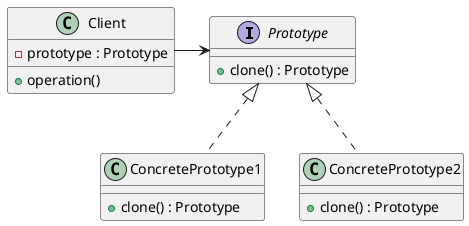

#### 7. Participants（参加者）

* **Prototype:** 自分自身を複製するためのインターフェースを定義する（`clone`メソッドなど）。
* **ConcretePrototype:** Prototypeインターフェースを実装し、自身の複製処理を具体的に記述する。
* **Client:** Prototypeインターフェースを利用して、新しいオブジェクトを複製する。

#### 8. Collaborations（協力作用）

クライアントは、`new` でクラスを指定する代わりに、保持している Prototype オブジェクトに対して `clone()` メソッドを呼び出します。

#### 9. Consequences（結果）

* **メリット:**
  * **実行時の製品追加・削除:** クライアントは Prototype を入れ替えるだけで、生成するオブジェクトの種類を動的に変更できる。
  * **サブクラス化の削減:** Factory Method と異なり、生成専用のクラス階層（Creatorの階層）を作る必要がない。
  * **動的な構成:** 複雑な初期設定済みのオブジェクトを「ひな形」として使い回せる。
* **デメリット:**
  * **クローンの複雑さ:** 複製対象のオブジェクトが複雑な参照（循環参照など）を持っている場合、深いコピー（Deep Copy）を正しく実装するのが非常に困難になる。

#### 10. Implementation（実装）

* **JavaのCloneable:** Javaでは `Object.clone()` を使うために `Cloneable` インターフェースを実装するが、この仕組みは古い設計であり、現在では「コピーコンストラクタ」や「シリアライズ」を用いた複製が推奨されることも多い。
* **浅いコピー vs 深いコピー:**
  * **浅いコピー (Shallow Copy):** フィールドの値だけをコピーする。参照先は共有される。
  * **深いコピー (Deep Copy):** 参照先のオブジェクトも含めてすべて新しく作り直す。

#### 11. Sample Code（Java）

```java
// Prototype インターフェース (Java標準の Cloneable を利用)
abstract class Shape implements Cloneable {
    private String id;
    protected String type;

    abstract void draw();

    public String getType() { return type; }
    public String getId() { return id; }
    public void setId(String id) { this.id = id; }

    @Override
    public Object clone() {
        Object clone = null;
        try {
            clone = super.clone();
        } catch (CloneNotSupportedException e) {
            e.printStackTrace();
        }
        return clone;
    }
}

// ConcretePrototype
class Rectangle extends Shape {
    public Rectangle() { type = "Rectangle"; }
    @Override
    public void draw() { System.out.println("四角形を描画中"); }
}

// Prototype 管理クラス
import java.util.Hashtable;
class ShapeCache {
    private static Hashtable<String, Shape> shapeMap = new Hashtable<>();

    public static Shape getShape(String shapeId) {
        Shape cachedShape = shapeMap.get(shapeId);
        return (Shape) cachedShape.clone(); // キャッシュから複製を返す
    }

    public static void loadCache() {
        Rectangle rect = new Rectangle();
        rect.setId("1");
        shapeMap.put(rect.getId(), rect);
    }
}

public class Main {
    public static void main(String[] args) {
        ShapeCache.loadCache();

        Shape clonedShape1 = ShapeCache.getShape("1");
        System.out.println("Shape : " + clonedShape1.getType());
    }
}
```

#### 12. Known Uses（実例）

* `java.lang.Object#clone()`
* JavaScript におけるプロトタイプベースの継承モデルそのもの。
* ゲーム開発（一度メモリにロードした敵キャラのデータをコピーして、大量の敵を出現させる）。

#### 13. Related Patterns（関連するパターン）

* **Abstract Factory:** 工場が「製品」を作る際に、内部で Prototype を使ってコピーして作るように実装されることがある。
* **Composite / Decorator:** 複雑な構造を一度組み立てた後、それを何度も使い回すために Prototype が併用される。

### 6. Adapter (適合器)

#### 1. Pattern Name and Classification

* **名称：** Adapter（アダプター）
* **分類：** 構造に関するパターン（Structural）

#### 2. Intent（意図）

あるクラスのインターフェースを、クライアントが期待する別のインターフェースに変換します。Adapterパターンは、互換性のないインターフェースを持つクラス同士を協力させることができます。

#### 3. Also Known As（別名）

* Wrapper（ラッパー）

#### 4. Motivation（動機）

既に完成し、十分にテストされている「古いクラス（既存資産）」があるとします。これを新しいシステムで使いたいのですが、新しいシステム側が求めているメソッド名や引数の形式と、古いクラスのものが一致しません。
古いクラスの中身を書き換えるのはリスクが高く、不可能です。そこで、ACアダプターが「コンセントの形状」と「ノートPCの端子」の間に入って電気を流すように、古いクラスを包み込み（Wrap）、新しいシステム向けの窓口を作る「Adapter」を導入することで、修正なしに再利用を可能にします。

#### 5. Applicability（適用可能性）

* 既存のクラスを使用したいが、そのインターフェースが自分たちの必要とするものと一致しない場合。
* 再利用可能なクラスを作成したいが、それが将来どのようなインターフェースを持つクラス（予測不可能なクラス）と組み合わされるか分からない場合。
* （オブジェクトAdapterの場合）複数の異なる既存サブクラスのインターフェースを統合して使いたい場合。

#### 6. Structure（構造）

※一般的によく使われる「委譲（オブジェクトAdapter）」の形式を示します。

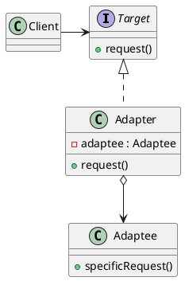

#### 7. Participants（参加者）

* **Target:** クライアントが利用するドメイン固有のインターフェースを定義する。
* **Client:** Targetインターフェースを満たすオブジェクトとやり取りをする。
* **Adaptee（適合される側）:** 適合が必要な既存のインターフェースを持つクラス。
* **Adapter:** TargetのインターフェースをAdapteeのインターフェースに適合させる。

#### 8. Collaborations（協力作用）

クライアントは Target インターフェースのメソッドを呼び出します。Adapter はその呼び出しを、内部で保持している Adaptee のメソッド呼び出しに変換して実行します。

#### 9. Consequences（結果）

* **メリット:**
  * **既存クラスの修正不要:** ソースコードがない、あるいは修正したくないクラスを再利用できる。
  * **単一責任原則:** データの変換やインターフェースの適合という責務を、メインのビジネスロジックから分離できる。
  * **柔軟性:** オブジェクトAdapterを使えば、一つのAdapterでAdapteeとそのすべてのサブクラスを適合できる。
* **デメリット:**
  * **コードの複雑化:** 変換のためだけに新しいクラスやインターフェースを導入するため、全体像が複雑になる。

#### 10. Implementation（実装）

* **クラスによるAdapter（継承）:** `Adaptee`を継承し、`Target`を実装する。シンプルだが柔軟性に欠ける。
* **オブジェクトによるAdapter（委譲）:** `Adaptee`のインスタンスをフィールドとして持ち、呼び出しを転送する。推奨される方法。
* **双方向Adapter:** 2つの異なるシステムで相互に利用できるよう、両方のインターフェースを実装すること。

#### 11. Sample Code（Java）

```java
// Target: 新しいシステムが期待するインターフェース
interface Print {
    void printWeak();
    void printStrong();
}

// Adaptee: 既に存在する古いクラス（修正したくない）
class Banner {
    private String string;
    public Banner(String string) { this.string = string; }
    public void showWithParen() { System.out.println("(" + string + ")"); }
    public void showWithAster() { System.out.println("*" + string + "*"); }
}

// Adapter: 古いクラスを新しいインターフェースに適合させる
class PrintBanner implements Print {
    private Banner banner; // 委譲による実装
    public PrintBanner(String string) {
        this.banner = new Banner(string);
    }
    @Override
    public void printWeak() {
        banner.showWithParen(); // メソッド名を変換
    }
    @Override
    public void printStrong() {
        banner.showWithAster(); // メソッド名を変換
    }
}

// Client
public class Main {
    public static void main(String[] args) {
        Print p = new PrintBanner("Hello");
        p.printWeak();
        p.printStrong();
    }
}
```

#### 12. Known Uses（実例）

* `java.util.Arrays#asList()`: 配列を List インターフェースに適合させる。
* `java.io.InputStreamReader`: InputStream (バイトストリーム) を Reader (文字ストリーム) に適合させる。
* GUIライブラリのイベントリスナーアダプター。

#### 13. Related Patterns（関連するパターン）

* **Bridge:** Adapterに似ているが、Bridgeは「設計段階から機能と実装を分ける」ためのもの。Adapterは「既存のものを後から適合させる」ためのもの。
* **Decorator:** Decoratorはインターフェースを変えずに「機能を追加」する。Adapterは「インターフェースを変える」。
* **Proxy:** Proxyはインターフェースを変えずに「アクセスを制御」する。

### 7. Bridge (橋渡し)

#### 1. Pattern Name and Classification

* **名称：** Bridge（ブリッジ）
* **分類：** 構造に関するパターン（Structural）

#### 2. Intent（意図）

抽象化（機能の階層）と実装（実装の階層）を分離して、それぞれが独立に変化（拡張）できるようにします。

#### 3. Also Known As（別名）

* Handle/Body（ハンドル／ボディ）

#### 4. Motivation（動機）

例えば、「様々な形状（円、四角）」を「異なるOS（Windows, Mac）」で描画するプログラムを考えます。
単純に継承を使うと、`WindowsCircle`, `MacCircle`, `WindowsSquare`, `MacSquare` といったクラスが必要になります。ここで新しい形状（三角形）を追加するとOSの数だけクラスが増え、新しいOSを追加すると形状の数だけクラスが増える「クラスの爆発（組み合わせの爆発）」が起こります。
Bridgeパターンは、この問題を「形状という機能の階層」と「OSごとの描画という実装の階層」に分けることで解決します。形状クラスは描画クラスを「保持（委譲）」することで、お互いの変更に影響されずに拡張が可能になります。

#### 5. Applicability（適用可能性）

* 抽象化とその実装を永続的に結合したくない場合（実行時に実装を切り替えたい場合）。
* 抽象化と実装の両方を、独立にサブクラス化して拡張したい場合。
* 抽象化の実装を変更しても、クライアントのコードを再コンパイルしたくない場合。
* クラス階層が肥大化し、機能と実装が混ざって管理が難しくなっている場合。

#### 6. Structure（構造）

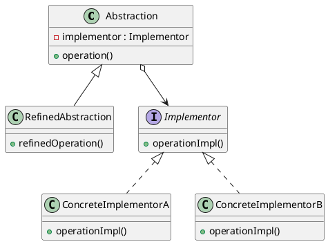

#### 7. Participants（参加者）

* **Abstraction (抽象化):** 機能側の最上位クラス。Implementorへの参照を保持する。
* **RefinedAbstraction (改善された抽象化):** Abstractionが提供する機能を追加・拡張したクラス。
* **Implementor (実装者):** 実装側のためのインターフェースを定義する。
* **ConcreteImplementor (具体的な実装者):** Implementorのインターフェースを具体的に実装する。

#### 8. Collaborations（協力作用）

`Abstraction` はクライアントからの要求を受け取ると、その処理を `Implementor` オブジェクトに委譲します。

#### 9. Consequences（結果）

* **メリット:**
  * **インターフェースと実装の分離:** 実装がインターフェースに縛られなくなるため、実行時に実装を差し替えることができる。
  * **拡張性の向上:** 「機能」を増やしても「実装」には影響せず、逆もまた然りである。
  * **実装の詳細を隠蔽:** クライアントからは抽象化されたインターフェースしか見えない。
* **デメリット:**
  * **設計の複雑化:** クラス階層を2つに分けるため、全体の構造を理解するのにコストがかかる。

#### 10. Implementation（実装）

* **Implementorの共有:** 複数のAbstractionで同じImplementorを共有することも可能。
* **実行時の選択:** どのConcreteImplementorを使うかを、コンストラクタの引数や設定ファイル、Factoryパターンなどで決定する。

#### 11. Sample Code（Java）

```java
// Implementor: 実装の階層（OSごとの描画）
interface DrawingAPI {
    void drawCircle(double x, double y, double radius);
}

// ConcreteImplementor 1
class WindowsDrawingAPI implements DrawingAPI {
    public void drawCircle(double x, double y, double radius) {
        System.out.println("Windowsで円を描画: " + x + "," + y + " 半径:" + radius);
    }
}

// ConcreteImplementor 2
class MacDrawingAPI implements DrawingAPI {
    public void drawCircle(double x, double y, double radius) {
        System.out.println("Macで円を描画: " + x + "," + y + " 半径:" + radius);
    }
}

// Abstraction: 機能の階層（図形の定義）
abstract class Shape {
    protected DrawingAPI drawingAPI; // 橋渡し（Bridge）
    protected Shape(DrawingAPI api) { this.drawingAPI = api; }
    public abstract void draw();
}

// RefinedAbstraction
class Circle extends Shape {
    private double x, y, radius;
    public Circle(double x, double y, double radius, DrawingAPI api) {
        super(api);
        this.x = x; this.y = y; this.radius = radius;
    }
    public void draw() {
        drawingAPI.drawCircle(x, y, radius); // 実装側に委譲
    }
}

// Client
public class Main {
    public static void main(String[] args) {
        Shape windowsCircle = new Circle(10, 10, 5, new WindowsDrawingAPI());
        Shape macCircle = new Circle(20, 20, 10, new MacDrawingAPI());

        windowsCircle.draw();
        macCircle.draw();
    }
}
```

#### 12. Known Uses（実例）

* JDBC (Java Database Connectivity): `DriverManager` (Abstraction) と各DB用ドライバ (Implementor)。
* AWT/Swing などのGUIツールキット（抽象的なコンポーネントと、OS固有のピア）。
* グラフィックスドライバの設計。

#### 13. Related Patterns（関連するパターン）

* **Abstract Factory:** 特定のBridgeを生成・構築するために使われることがある。
* **Adapter:** Bridgeは設計段階で分離するために使うが、Adapterは設計が終わった後の互換性のないクラスをつなぐために使う。

### 8. Composite (合成物)

#### 1. Pattern Name and Classification

* **名称：** Composite（コンポジット）
* **分類：** 構造に関するパターン（Structural）

#### 2. Intent（意図）

オブジェクトを木構造に構成して、「部分-全体」の階層を表現します。Compositeパターンを用いることで、クライアントは「個別のオブジェクト」と「オブジェクトを組み合わせたもの（容器）」を、全く同一に扱うことができるようになります。

#### 3. Also Known As（別名）

なし

#### 4. Motivation（動機）

コンピュータのファイルシステムを想像してください。「ファイル」と「ディレクトリ（フォルダ）」があります。ディレクトリの中にはファイルだけでなく、別のディレクトリも入れることができます。
もし、プログラムがファイルとディレクトリを別々の型として扱っていたら、ディレクトリの中身をスキャンする際に「これはファイルか？それともディレクトリか？」といちいち判定（if文など）しなければなりません。
Compositeパターンでは、ファイルもディレクトリも共通の「エントリー」という親クラスを持たせ、どちらに対しても `ls` や `getSize()` といった操作を呼べるようにします。これにより、再帰的な構造を非常にシンプルに扱えるようになります。

#### 5. Applicability（適用可能性）

* オブジェクトの「部分-全体」の階層構造を表現したい場合。
* クライアントが、合成されたオブジェクトと単一のオブジェクトの違いを意識せずに、一貫した方法で操作できるようにしたい場合。

#### 6. Structure（構造）

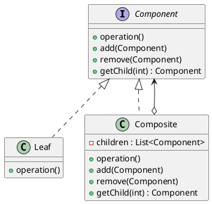

#### 7. Participants（参加者）

* **Component:** 合成されるすべてのオブジェクトに共通のインターフェース。
* **Leaf (葉):** 階層の末端を表すオブジェクト（子を持たない）。
* **Composite (合成物):** 子を持つオブジェクト。Componentインターフェースを実装し、子を管理するメソッド（add, removeなど）を持つ。
* **Client:** Componentインターフェースを通じて、木構造内のオブジェクトを操作する。

#### 8. Collaborations（協力作用）

クライアントは `Component` インターフェースを介して操作を行います。対象が `Leaf` であれば直接その処理が実行され、`Composite` であれば、その中に含まれる「子」たちに対して再帰的に操作を転送します。

#### 9. Consequences（結果）

* **メリット:**
  * **クライアントの単純化:** 単一オブジェクトと集合オブジェクトを区別する複雑なコードが不要になる。
  * **新しいコンポーネントの追加が容易:** 既存のコードを変更せずに、新しい種類の `Leaf` や `Composite` を追加できる。
* **デメリット:**
  * **設計が汎用的になりすぎる:** 「特定の Composite には特定の種類の Leaf しか入れたくない」といった制約を型システムで強制するのが難しくなる（実行時のチェックが必要になる）。

#### 10. Implementation（実装）

* **子管理メソッドの場所:** `Component`（親）に `add/remove` を置くか（透明性の重視）、`Composite`（子）だけに置くか（安全性の重視）という設計判断が必要。GoFでは透明性を重視し、親に置くことを例示している。
* **親への参照:** 子オブジェクトが親オブジェクトへの参照を持つようにすると、木構造を遡るのが容易になる。
* **キャッシュ:** 木構造が深い場合、上位の `Composite` で計算結果（例：合計ファイルサイズ）をキャッシュして高速化を図ることがある。

#### 11. Sample Code（Java）

```java
import java.util.ArrayList;
import java.util.List;

// Component
abstract class Entry {
    public abstract String getName();
    public abstract int getSize();
    public void add(Entry entry) { throw new UnsupportedOperationException(); }
    public void printList() { printList(""); }
    protected abstract void printList(String prefix);
}

// Leaf (File)
class File extends Entry {
    private String name;
    private int size;
    public File(String name, int size) { this.name = name; this.size = size; }
    public String getName() { return name; }
    public int getSize() { return size; }
    protected void printList(String prefix) {
        System.out.println(prefix + "/" + this.toString());
    }
    public String toString() { return name + " (" + size + ")"; }
}

// Composite (Directory)
class Directory extends Entry {
    private String name;
    private List<Entry> directory = new ArrayList<>();
    public Directory(String name) { this.name = name; }
    public String getName() { return name; }
    public int getSize() {
        int size = 0;
        for (Entry entry : directory) { size += entry.getSize(); }
        return size;
    }
    public void add(Entry entry) { directory.add(entry); }
    protected void printList(String prefix) {
        System.out.println(prefix + "/" + name);
        for (Entry entry : directory) {
            entry.printList(prefix + "/" + name);
        }
    }
}

// Client
public class Main {
    public static void main(String[] args) {
        Directory root = new Directory("root");
        Directory bin = new Directory("bin");
        root.add(bin);
        bin.add(new File("ls", 100));
        bin.add(new File("mkdir", 120));
        
        root.printList(); // ファイルもディレクトリも区別せず出力
    }
}
```

#### 12. Known Uses（実例）

* Java AWT/Swing の `Container` と `Component`（ボタンもパネルも同様に扱える）。
* XML や HTML の DOM (Document Object Model) 構造。
* グラフィックソフトにおける「グループ化」機能。

#### 13. Related Patterns（関連するパターン）

* **Decorator:** Composite と組み合わせて使われることが多い。Decorator は「機能追加」を目的とし、Composite は「構造の管理」を目的とする。
* **Flyweight:** Leaf オブジェクトを共有してメモリを節約する場合に併用される。
* **Iterator:** Composite の木構造を走査するために Iterator が使われる。
* **Visitor:** 構造と処理を分離するために、Composite 構造の上で Visitor が動き回る。

### 9. Decorator (装飾者)

#### 1. Pattern Name and Classification

* **名称：** Decorator（デコレーター）
* **分類：** 構造に関するパターン（Structural）

#### 2. Intent（意図）

オブジェクトに新しい責任（機能）を動的に追加します。サブクラス化による機能拡張よりも柔軟な代替手段を提供し、中身のコードを変更せずにオブジェクトの振る舞いを「包む」ことで拡張します。

#### 3. Also Known As（別名）

* Wrapper（ラッパー）

#### 4. Motivation（動機）

例えば、テキストを表示するプログラムで、「枠線をつける機能」や「スクロールバーをつける機能」を追加したいとします。
これを継承（サブクラス化）で実現しようとすると、「枠線付きテキスト」「スクロール付きテキスト」「枠線とスクロール両方付きテキスト」…といった具合に、組み合わせの数だけクラスが必要になります。
Decoratorパターンでは、核となる「テキスト表示」オブジェクトを、「枠線デコレーター」で包み、さらにそれを「スクロールデコレーター」で包むという構成をとります。これにより、実行時に必要な機能を好きな組み合わせでトッピングできるようになります。

#### 5. Applicability（適用可能性）

* 他のオブジェクトに影響を与えず、個々のオブジェクトに動的かつ透明な形で責任を追加したい場合。
* 後で取り消し可能な責任を追加したい場合。
* 拡張のためにサブクラスを大量に作るのが非実用的な場合（クラス爆発の防止）。

#### 6. Structure（構造）

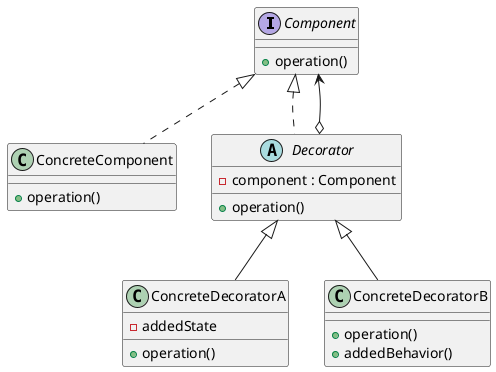

#### 7. Participants（参加者）

* **Component:** 責任を動的に追加できるオブジェクトのインターフェースを定義する。
* **ConcreteComponent:** 実際に機能が定義される核となるオブジェクト。
* **Decorator:** Componentへの参照を保持し、Componentのインターフェースに準拠したインターフェースを定義する。
* **ConcreteDecorator:** Componentに責任（機能や状態）を実際に追加する具体的な装飾者。

#### 8. Collaborations（協力作用）

Decoratorは、自分自身の操作の前後に、保持しているComponentに対してリクエストを転送（委譲）します。その際、前後に独自の処理を追加することで「装飾」を行います。

#### 9. Consequences（結果）

* **メリット:**
  * **継承よりも柔軟:** 実行時に機能の付け外しができる。
  * **クラスの肥大化を防止:** 多くの機能を持つ巨大なクラス（God Class）を作るのではなく、小さな機能を持つクラスを組み合わせることで複雑さを管理できる。
* **デメリット:**
  * **小さなオブジェクトが大量に発生:** 似たような小さなオブジェクト（装飾の層）がたくさん生成され、デバッグが難しくなることがある。
  * **同一性の問題:** 装飾されたオブジェクトは、元のオブジェクトとは別個のインスタンスになるため、`instaceof`等による判定に依存するコードは壊れる可能性がある。

#### 10. Implementation（実装）

* **インターフェースの一致:** Decoratorは必ず装飾対象（Component）と同じインターフェースを持たなければならない。
* **軽量なComponent:** デコレーターを重ねやすくするために、核となるComponentクラスはできるだけシンプルに保つ。
* **抽象Decoratorの省略:** 装飾者が1つしかない場合は、抽象クラスとしてのDecoratorを作らずに直接Componentをラップしてもよい。

#### 11. Sample Code（Java）

```java
// Component
interface Display {
    String getText();
}

// ConcreteComponent
class PlainDisplay implements Display {
    private String text;
    public PlainDisplay(String text) { this.text = text; }
    public String getText() { return text; }
}

// Decorator
abstract class DisplayDecorator implements Display {
    protected Display display;
    protected DisplayDecorator(Display display) { this.display = display; }
}

// ConcreteDecorator
class BorderDecorator extends DisplayDecorator {
    public BorderDecorator(Display display) { super(display); }
    public String getText() {
        return "|" + display.getText() + "|"; // 枠線で装飾
    }
}

class ScopedDecorator extends DisplayDecorator {
    public ScopedDecorator(Display display) { super(display); }
    public String getText() {
        return "[" + display.getText() + "]"; // 括弧で装飾
    }
}

// Client
public class Main {
    public static void main(String[] args) {
        Display d1 = new PlainDisplay("Hello");
        Display d2 = new BorderDecorator(d1); // 枠線を付与
        Display d3 = new ScopedDecorator(d2); // さらに括弧を付与
        
        System.out.println(d3.getText()); // 出力: [|Hello|]
    }
}
```

#### 12. Known Uses（実例）

* **Java I/O:** `new BufferedReader(new InputStreamReader(new FileInputStream("test.txt")))`
  * `FileInputStream`（核）を`Buffered`（バッファ機能）等で装飾している。
* Swingの `JScrollPane` (コンポーネントをスクロール可能にする装飾)。

#### 13. Related Patterns（関連するパターン）

* **Adapter:** Adapterはインターフェースを「変更」するが、Decoratorはインターフェースを「維持」して機能を追加する。
* **Composite:** Decoratorは「1つの成分を持つComposite」と見なすことができる。ただし目的は「集約」ではなく「装飾」。
* **Strategy:** 機能拡張を「外側を包む（Decorator）」のではなく「中身を入れ替える（Strategy）」ことで実現するパターン。

### 10. Facade (正面)

#### 1. Pattern Name and Classification

* **名称：** Facade（ファサード）
* **分類：** 構造に関するパターン（Structural）

#### 2. Intent（意図）

サブシステム内の一連のインターフェースに対して、統合された一つのインターフェースを提供します。Facadeパターンは、サブシステムの利用を容易にするための高レベルなインターフェースを定義します。

#### 3. Also Known As（別名）

なし

#### 4. Motivation（動機）

大規模なシステムやライブラリは、多くのクラスが複雑に絡み合って動作します。例えば、「ビデオの録画」という処理を行うには、オーディオの設定、ビデオの設定、ファイルの書き込み、圧縮アルゴリズムの選択など、多くのコンポーネントを正しく初期化し、正しい順番で呼び出す必要があります。
これらをクライアントが直接操作するのは非常に困難でミスが起きやすいです。Facadeパターンでは、これら複雑な手続きを一手に引き受ける「窓口（正面）」クラスを一つ作り、クライアントには `record()` というシンプルなメソッドだけを公開します。

#### 5. Applicability（適用可能性）

* 複雑なサブシステムに対して、シンプルで限定的なインターフェースを提供したい場合。
* クライアントとサブシステムの実装クラス群の間に多くの依存関係があり、それらを分離（疎結合に）したい場合。
* サブシステムを階層化したい場合。Facadeを各階層の入り口として使用し、階層間の依存関係を整理します。

#### 6. Structure（構造）

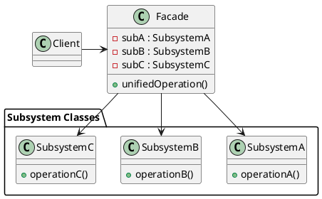

#### 7. Participants（参加者）

* **Facade:** サブシステムのどのクラスがどの要求に応えるかを知っており、クライアントのリクエストを適切なサブシステムオブジェクトに委譲する。
* **Subsystem classes:** サブシステムの機能を実装する。Facadeからの要求を処理するが、Facadeの存在は知らない。

#### 8. Collaborations（協力作用）

クライアントは Facade に対してリクエストを送信します。Facade は、そのリクエストを処理するために必要な複数のサブシステムコンポーネントを組み合わせて実行します。

#### 9. Consequences（結果）

* **メリット:**
  * **使いやすさの向上:** 複雑なシステムを詳細を知らなくても利用できる。
  * **疎結合:** クライアントがサブシステムの内部構造に依存しなくなるため、サブシステム内部の変更がクライアントに波及しにくい。
  * **アクセスの制限:** サブシステムの機能をあえて隠すことで、誤った使い方を防ぐことができる。
* **デメリット:**
  * **Facadeの肥大化:** 全ての機能をFacadeに集約しようとすると、Facade自体が巨大で複雑なクラス（God Class）になってしまう恐れがある。

#### 10. Implementation（実装）

* **サブシステムの隠蔽:** 通常、サブシステムクラスはクライアントから直接アクセスされることを禁止しないが、アクセスを Facade 経由に限定することで保守性が高まる。
* **複数のFacade:** サブシステムが巨大な場合、役割ごとに複数の Facade を作ってもよい。

#### 11. Sample Code（Java）

```java
// サブシステム 1
class CPU {
    public void freeze() { System.out.println("CPUを停止"); }
    public void execute() { System.out.println("プログラムを実行"); }
}

// サブシステム 2
class Memory {
    public void load() { System.out.println("データをメモリに展開"); }
}

// サブシステム 3
class HardDrive {
    public void readData() { System.out.println("ディスクからデータを読み込み"); }
}

// Facade
class ComputerFacade {
    private CPU cpu;
    private Memory memory;
    private HardDrive hardDrive;

    public ComputerFacade() {
        this.cpu = new CPU();
        this.memory = new Memory();
        this.hardDrive = new HardDrive();
    }

    // クライアントはこのメソッドを呼ぶだけでいい
    public void start() {
        cpu.freeze();
        hardDrive.readData();
        memory.load();
        cpu.execute();
        System.out.println("コンピュータの起動が完了しました");
    }
}

// Client
public class Main {
    public static void main(String[] args) {
        ComputerFacade computer = new ComputerFacade();
        computer.start(); // 内部の複雑な手順を知る必要はない
    }
}
```

#### 12. Known Uses（実例）

* `java.net.URL`: 内部で行われている複雑な接続、ハンドシェイク、データ取得の手続きを隠蔽している。
* jQuery (JavaScriptライブラリ): 異なるブラウザごとの複雑なDOM操作を `$` 関数という Facade で統一している。
* Session Bean (EJB): 複数のエンティティBeanを操作するビジネスロジックをまとめる役割。

#### 13. Related Patterns（関連するパターン）

* **Abstract Factory:** Facade と併用して、サブシステムオブジェクトを生成するために使われることがある。
* **Mediator:** オブジェクト間の通信を抽象化する点は似ているが、Mediatorは「双方向」の調整を行い、Facadeは「一方通行」のインターフェース提供に特化している。
* **Singleton:** Facade オブジェクトは通常1つで良いため、Singleton にされることが多い。

### 11. Flyweight (フライ級/軽量化)

#### 1. Pattern Name and Classification

* **名称：** Flyweight（フライウェイト）
* **分類：** 構造に関するパターン（Structural）

#### 2. Intent（意図）

オブジェクトを共有することによって、大量の細かいオブジェクトを効率的にサポートします。メモリ消費を最小限に抑えることを目的とします。

#### 3. Also Known As（別名）

なし

#### 4. Motivation（動機）

例えば、文書作成エディタを開発しており、文書内の「一文字一文字」をオブジェクトとして扱いたいとします。10万文字の文書であれば、10万個のオブジェクトが必要になりますが、これではメモリを使い果たしてしまいます。
しかし、よく考えると「文字の種類（A, B, C...）」や「フォント」などのデータは共通です。異なるのは「画面上の位置（座標）」だけです。
Flyweightパターンでは、共通のデータ（**内在的状態**）を一つのオブジェクトとして共有し、変化するデータ（**外在的状態**：座標など）は利用側がその都度渡すようにします。これにより、10万個の文字に対して、実体としてのオブジェクトは文字種分の数十個で済むようになります。

#### 5. Applicability（適用可能性）

以下の条件すべてに当てはまる場合に適用します。

* アプリケーションが大量のオブジェクトを使用している。
* それにより、メモリコストが非常に高くなっている。
* オブジェクトの状態の大部分が「外在的（外部から与えられるもの）」にできる。
* 外在的な状態を取り除けば、多くのオブジェクトを比較的少数の共有オブジェクトに置き換えられる。
* アプリケーションがオブジェクトの同一性（`==` での比較など）に依存していない。

#### 6. Structure（構造）

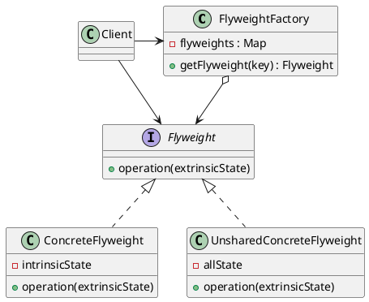

#### 7. Participants（参加者）

* **Flyweight:** 外在的状態を受け取って動作する操作を定義するインターフェース。
* **ConcreteFlyweight:** Flyweightを実装し、共有される「内在的状態（固有の情報）」を保持する。
* **UnsharedConcreteFlyweight:** すべてのFlyweightが共有されるわけではない場合のクラス（Compositeパターンのように、子の集合を持つ場合など）。
* **FlyweightFactory:** Flyweightオブジェクトを管理・生成する。既存のインスタンスがあればそれを返し、なければ新しく作って保存する。
* **Client:** Flyweightへの参照を保持し、外在的状態を計算・管理してFlyweightに渡す。

#### 8. Collaborations（協力作用）

クライアントは `FlyweightFactory` にオブジェクトを要求します。Factory は適切なインスタンスを共有プールから提供します。クライアントはそのオブジェクトのメソッドを呼ぶ際、自分側で管理している「外在的な情報（座標、色など）」を引数として渡します。

#### 9. Consequences（結果）

* **メリット:**
  * **メモリの劇的な節約:** インスタンスの総数を減らすことで、メモリ使用量を大幅に削減できる。
* **デメリット:**
  * **実行速度のトレードオフ:** 共通オブジェクトに外部から状態を渡すための計算や、Factoryからの検索に時間がかかる。
  * **複雑さの導入:** 内在的状態と外在的状態を論理的に切り分ける設計が必要になる。

#### 10. Implementation（実装）

* **共有インスタンスの管理:** ハッシュマップ（`Map`）などでインスタンスを保持する。
* **ガベージコレクション:** Javaなどの場合、参照が残っているとメモリが解放されないため、`WeakReference`（弱参照）などを用いる検討が必要な場合もある。
* **不変性 (Immutability):** 共有されるオブジェクトの状態が途中で変わると、すべての利用箇所に影響するため、内在的状態は `final` にして不変に保つのが一般的。

#### 11. Sample Code（Java）

```java
import java.util.HashMap;
import java.util.Map;

// Flyweight: 内在的状態（文字そのもの）を定義
class Character {
    private final char symbol; // 内在的状態
    public Character(char symbol) { this.symbol = symbol; }
    
    // 外在的状態（座標）を引数で受け取る
    public void display(int x, int y) {
        System.out.println("文字 '" + symbol + "' を座標(" + x + "," + y + ")に描画");
    }
}

// FlyweightFactory
class CharacterFactory {
    private Map<java.lang.Character, Character> pool = new HashMap<>();

    public Character getCharacter(char symbol) {
        if (!pool.containsKey(symbol)) {
            pool.put(symbol, new Character(symbol));
            System.out.println("新しいインスタンス '" + symbol + "' を生成");
        }
        return pool.get(symbol);
    }
}

// Client
public class Main {
    public static void main(String[] args) {
        CharacterFactory factory = new CharacterFactory();
        
        // 'A'を2回使うが、インスタンスは1つだけ
        Character a1 = factory.getCharacter('A');
        a1.display(10, 10);
        
        Character a2 = factory.getCharacter('A');
        a2.display(20, 30);
        
        System.out.println("a1 と a2 は同じインスタンスか: " + (a1 == a2));
    }
}
```

#### 12. Known Uses（実例）

* `java.lang.Integer#valueOf(int)`: -128〜127の範囲の数値はキャッシュされており、同じインスタンスが返される。
* Javaの **String Pool**: 文字列リテラルはメモリ上で共有される。
* GUIツールキットにおける文字（グリフ）の描画。

#### 13. Related Patterns（関連するパターン）

* **Singleton:** Factoryは通常Singletonとして実装される。Flyweight自体が「限定された複数のSingleton」のように見えることもある。
* **Composite:** Compositeパターンの「葉（Leaf）」の部分をFlyweightにして共有することが多い。
* **State / Strategy:** 状態オブジェクトや戦略オブジェクトが状態を持たない（ステートレスな）場合、Flyweightとして共有できる。

### 12. Proxy (代理人)

#### 1. Pattern Name and Classification

* **名称：** Proxy（プロキシ）
* **分類：** 構造に関するパターン（Structural）

#### 2. Intent（意図）

あるオブジェクトへのアクセスを制御するために、そのオブジェクトの「身代わり」または「プレースホルダー」となるオブ
ジェクトを提供します。

#### 3. Also Known As（別名）

* Surrogate（サロゲート／身代わり）

#### 4. Motivation（動機）

非常に大きな画像ファイルを画面に表示する文書エディタを考えます。文書を開いた瞬間に、すべての巨大な画像をメモリにロードすると、起動が非常に遅くなります。
しかし、画像がスクロールされて画面に現れるまでは、実際の画像データは必要ありません。そこで、本物の画像のふりをする「プロキシ（代理人）」を配置します。プロキシは画像のサイズ情報だけを持ち、必要になるまでは本物のロードを遅らせます。そして、いざ描画が必要になった瞬間に本物を生成・ロードして処理を委譲します。これにより、リソースの節約とレスポンスの向上を両立できます。

#### 5. Applicability（適用可能性）

* **仮想プロキシ (Virtual Proxy):** インスタンス生成コストが高いオブジェクトを、必要になるまで生成したくない場合（遅延初期化）。
* **遠隔プロキシ (Remote Proxy):** ネットワーク上の異なるアドレス空間にあるオブジェクトを、あたかもローカルにあるかのように見せたい場合。
* **保護プロキシ (Protection Proxy):** オブジェクトへのアクセス権限をチェックし、許可されたユーザーにのみ操作を許したい場合。
* **スマートリファレンス (Smart Reference):** オブジェクトへのアクセス時に、参照カウンタの更新やロックの取得など、追加の処理を行いたい場合。

#### 6. Structure（構造）

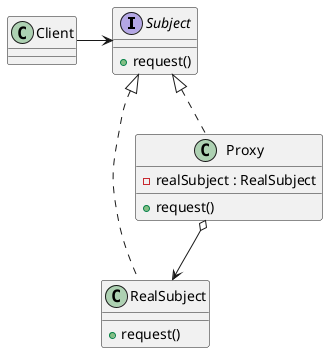

#### 7. Participants（参加者）

* **Subject:** `RealSubject` と `Proxy` に共通のインターフェース。これにより、クライアントは両者を区別せずに扱える。
* **RealSubject:** Proxyが代理を務める「本物」のオブジェクト。
* **Proxy:** `RealSubject` への参照を保持する。`Subject` と同じインターフェースを持ち、必要に応じて `RealSubject` の生成やアクセス制御を行う。
* **Client:** `Subject` インターフェースを介してオブジェクトを利用する。

#### 8. Collaborations（協力作用）

Proxyは、クライアントからのリクエストを受け取ると、種類に応じて「アクセス制限」や「遅延初期化」などの処理を行い、最終的に `RealSubject` のメソッドを呼び出して結果をクライアントに返します。

#### 9. Consequences（結果）

* **メリット:**
  * **透過的なアクセス制御:** クライアント側のコードを変更せずに、オブジェクトの生成タイミングやアクセス権を管理できる。
  * **リソースの効率化:** 仮想プロキシにより、メモリ消費を抑え、起動時間を短縮できる。
  * **ネットワークの隠蔽:** 遠隔プロキシにより、複雑なネットワーク通信を意識せずに外部リソースを扱える。
* **デメリット:**
  * **オーバーヘッド:** 代理人を介するため、直接呼び出すよりもわずかに処理が遅くなる。
  * **コードの複雑化:** プロキシクラスを導入するため、クラス数が増える。

#### 10. Implementation（実装）

* **透過性の維持:** ProxyとRealSubjectは必ず同じインターフェース（または親クラス）を継承する。
* **Javaの動的プロキシ:** `java.lang.reflect.Proxy` クラスを使用すると、実行時に動的にプロキシクラスを生成できるため、個別のプロキシクラスを手書きする手間を省ける。

#### 11. Sample Code（Java）

```java
// Subject
interface Image {
    void display();
}

// RealSubject: 生成に時間がかかるクラス
class RealImage implements Image {
    private String fileName;
    public RealImage(String fileName) {
        this.fileName = fileName;
        loadFromDisk();
    }
    private void loadFromDisk() {
        System.out.println("ディスクから重いデータをロード中: " + fileName);
    }
    public void display() {
        System.out.println("画像を表示します: " + fileName);
    }
}

// Proxy: 遅延初期化を行う代理人
class ProxyImage implements Image {
    private RealImage realImage;
    private String fileName;

    public ProxyImage(String fileName) { this.fileName = fileName; }

    public void display() {
        if (realImage == null) {
            realImage = new RealImage(fileName); // 呼び出されて初めて生成
        }
        realImage.display();
    }
}

// Client
public class Main {
    public static void main(String[] args) {
        Image image = new ProxyImage("huge_photo.jpg");
        
        // この時点ではまだロードされない
        System.out.println("まだ画像はロードされていません。");
        
        // display()を呼んだ瞬間にロードされる
        image.display();
    }
}
```

#### 12. Known Uses（実例）

* **Hibernate / JPA:** データベースからエンティティを取得する際、関連するオブジェクトを必要になるまで読み込まない「遅延ロード（Lazy Loading）」機能。
* **Spring AOP:** メソッド実行の前後にログ出力やトランザクション管理を挟み込む際、動的プロキシが使われる。
* **Java RMI:** リモートオブジェクトをローカルで操作するためのスタブ。

#### 13. Related Patterns（関連するパターン）

* **Adapter:** Adapterはインターフェースを「変える」が、Proxyはインターフェースを「変えない」。
* **Decorator:** Decoratorは「機能を追加」するが、Proxyは「アクセスを制御（管理）」する。
* **Facade:** Facadeは「複数のオブジェクトへの窓口」だが、Proxyは「単一のオブジェクトの身代わり」。

### 13. Chain of Responsibility (責任の連鎖)

#### 1. Pattern Name and Classification

* **名称：** Chain of Responsibility（責任の連鎖）
* **分類：** 振る舞いに関するパターン（Behavioral）

#### 2. Intent（意図）

要求を送る側と受ける側の結合を避けるため、複数のオブジェクトに要求を処理する機会を与えます。受信側のオブジェクトを鎖状（チェーン状）につなぎ、あるオブジェクトが処理できない場合は次のオブジェクトへ、というように要求を順次渡していきます。

#### 3. Also Known As（別名）

なし

#### 4. Motivation（動機）

例えば、企業の承認システムを考えます。「経費精算」の要求が出されたとき、金額によって承認者が異なります。

* 1万円以下なら「係長」
* 5万円以下なら「課長」
* それ以上なら「部長」

もしクライアント（申請者）が「if (金額 < 10000) ...」と直接判定して特定の役職クラスを呼び出していると、役職や権限が変わるたびにクライアント側のコードを修正しなければなりません。
Chain of Responsibilityパターンでは、係長→課長→部長という「鎖」を作ります。申請者は鎖の先頭に要求を投げるだけで済みます。各役職者は「自分が処理できるか？」を判断し、できなければ黙って次の人にパスします。

#### 5. Applicability（適用可能性）

* 1つの要求に対して、それを処理できるオブジェクトが複数あり、どのオブジェクトが処理するかがあらかじめ決まっていない場合。
* 要求を処理するオブジェクトの集合を、実行時に動的に指定したい場合。
* 「誰が処理するか」を明示せずに、複数のオブジェクトのうちのいずれかに要求を投げたい場合。

#### 6. Structure（構造）

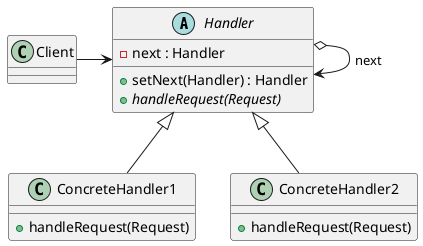

#### 7. Participants（参加者）

* **Handler:** 要求を処理するためのインターフェースを定義し、（任意で）後継者（successor）へのリンクを保持する。
* **ConcreteHandler:** 自分が担当する要求を処理する。処理できない場合は、要求を後継者に転送する。
* **Client:** 鎖の先頭にある ConcreteHandler オブジェクトに要求を送信する。

#### 8. Collaborations（協力作用）

クライアントが要求を出すと、その要求は鎖に沿って移動します。各 `ConcreteHandler` は、自分が処理できるかどうかを判断し、処理した場合はそこで終了、処理できない場合は次の `Handler` へ委譲します。

#### 9. Consequences（結果）

* **メリット:**
  * **結合度の低下:** クライアントは「誰が処理するか」を知る必要がなく、受信側も「誰が送ってきたか」を知る必要がない。
  * **柔軟な責任割当:** 鎖の順番を入れ替えたり、新しい処理者を途中に挿入したりすることが容易。
* **デメリット:**
  * **受け取りの保証がない:** 鎖の最後まで誰も処理しなかった場合、その要求は「無視」されることになる（落とし所が必要）。
  * **デバッグの複雑化:** 要求がどのオブジェクトで処理されたのか、実行時の鎖の構成を追うのが難しい場合がある。

#### 10. Implementation（実装）

* **後継者の保持:** 通常、抽象クラス `Handler` で `next` フィールドを保持し、デフォルトの転送処理を実装する。
* **要求の表現:** 要求を単なる引数とするか、あるいは「Requestオブジェクト」としてカプセル化して渡す。

#### 11. Sample Code（Java）

```java
// 要求クラス
class Trouble {
    private int number;
    public Trouble(int number) { this.number = number; }
    public int getNumber() { return number; }
}

// Handler
abstract class Support {
    private String name;
    private Support next; // 次の担当者
    public Support(String name) { this.name = name; }
    public Support setNext(Support next) { this.next = next; return next; }

    public final void support(Trouble trouble) {
        if (resolve(trouble)) {
            System.out.println(trouble.getNumber() + " は " + name + " が解決しました。");
        } else if (next != null) {
            next.support(trouble); // 次の人にパス
        } else {
            System.out.println(trouble.getNumber() + " は誰も解決できませんでした。");
        }
    }
    protected abstract boolean resolve(Trouble trouble);
}

// ConcreteHandler A
class LimitSupport extends Support {
    private int limit;
    public LimitSupport(String name, int limit) { super(name); this.limit = limit; }
    protected boolean resolve(Trouble trouble) {
        return trouble.getNumber() < limit;
    }
}

// Client
public class Main {
    public static void main(String[] args) {
        Support alice = new LimitSupport("Alice", 100);
        Support bob = new LimitSupport("Bob", 200);
        alice.setNext(bob); // 鎖を作る

        alice.support(new Trouble(50));  // Aliceが解決
        alice.support(new Trouble(150)); // Bobが解決
        alice.support(new Trouble(250)); // 誰も解決できない
    }
}
```

#### 12. Known Uses（実例）

* **Java Servlet Filter:** HTTPリクエストを複数のフィルタ（認証、ログ、圧縮など）で順番に処理する。
* **例外処理 (try-catch):** 発生した例外を、適合する `catch` ブロックが見つかるまで呼び出し元へと伝播させる仕組み。
* **GUIのイベント伝播:** 子要素で処理されなかったマウスイベントが、親要素へと順次伝わっていく仕組み（バブリング）。

#### 13. Related Patterns（関連するパターン）

* **Composite:** Compositeパターンで親に向かって要求を投げ続ける際、Chain of Responsibilityが自然に形成されることが多い。
* **Command:** 鎖の中を流れる「要求」をオブジェクトとして表現する場合、Commandパターンが使われる。

### 14. Command (命令)

#### 1. Pattern Name and Classification

* **名称：** Command（コマンド）
* **分類：** 振る舞いに関するパターン（Behavioral）

#### 2. Intent（意図）

「要求」をオブジェクトとしてカプセル化します。これにより、クライアントを異なる要求でパラメータ化したり、要求をキューに詰めたり、ログに記録したり、取り消し（Undo）可能な操作をサポートしたりできます。

#### 3. Also Known As（別名）

* Action（アクション）
* Transaction（トランザクション）

#### 4. Motivation（動機）

例えば、グラフィックエディタの「ボタン」を考えてみましょう。ボタン自体は「クリックされたら何かを実行する」という機能だけを持ち、具体的に「保存する」のか「切り取る」のかという中身は知りません。
もしボタンの中に直接「保存」のロジックを書くと、そのボタンは保存専用になってしまい再利用できません。
Commandパターンでは、「保存」という命令を独立したオブジェクトにします。ボタン（Invoker）は単に「Commandオブジェクトの `execute()` を呼ぶ」という契約だけを守ります。これにより、同じボタンに異なる命令を割り当てたり、実行した命令をスタックに積んで「元に戻す（Undo）」機能を実現したりすることが容易になります。

#### 5. Applicability（適用可能性）

* 実行したいアクションでオブジェクトをパラメータ化したい場合（コールバック関数のオブジェクト指向版）。
* 要求を異なるタイミングで指定、キューに入れ、実行したい場合。
* 「元に戻す（Undo）」機能をサポートしたい場合（実行前の状態を保持し、逆操作を行う）。
* システムのクラッシュに備えて、操作の履歴をログに記録し、再起動後に再適用したい場合。

#### 6. Structure（構造）

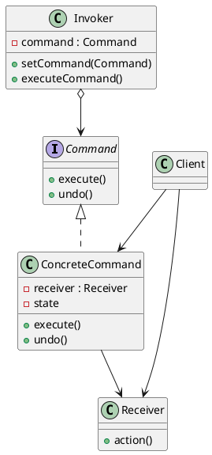

#### 7. Participants（参加者）

* **Command:** 操作を実行するためのインターフェースを宣言する。
* **ConcreteCommand:** `Receiver`（受信者）を保持し、そのメソッドを呼び出すことで `execute` を実装する。
* **Invoker (起動者):** 命令を保持し、実行のタイミング（ボタンクリックなど）で `execute` を呼び出す。
* **Receiver (受信者):** 実際のビジネスロジック（保存、描画など）を実行するクラス。
* **Client:** `ConcreteCommand` を生成し、`Receiver` を割り当てる。

#### 8. Collaborations（協力作用）

1. `ConcreteCommand` インスタンスを作成し、`Receiver` を指定する。
2. `Invoker` はその `Command` オブジェクトを保持する。
3. `Invoker` が要求を出すと、`Command.execute()` が呼ばれる。
4. `ConcreteCommand` は `Receiver` のメソッドを呼び出し、実際の処理が行われる。

#### 9. Consequences（結果）

* **メリット:**
  * **起動者と受信者の疎結合:** 命令を出す側（ボタン）と受ける側（ロジック）が直接お互いを知る必要がない。
  * **合成命令 (Macro Command):** 複数のCommandを組み合わせて、一つの命令として実行できる（Compositeパターンの応用）。
  * **拡張性:** 既存のクラスを変更せずに新しい命令を追加できる。
* **デメリット:**
  * **クラス数の増加:** 個々の命令（保存、コピー、貼り付け...）ごとにクラスを作成するため、システム内のクラス数が大幅に増える。

#### 10. Implementation（実装）

* **Undoの実現:** 命令オブジェクトに実行前の状態を保存させるか、あるいは「逆の操作」を定義する。
* **Javaのラムダ式:** 現代的なJavaでは、単純な命令であれば匿名クラスの代わりにラムダ式を使って記述を簡略化できる。

#### 11. Sample Code（Java）

```java
// Command インターフェース
interface Command {
    void execute();
    void undo();
}

// Receiver: 実際のライト
class Light {
    public void on() { System.out.println("ライトがつきました"); }
    public void off() { System.out.println("ライトが消えました"); }
}

// ConcreteCommand
class LightOnCommand implements Command {
    private Light light;
    public LightOnCommand(Light light) { this.light = light; }
    public void execute() { light.on(); }
    public void undo() { light.off(); }
}

// Invoker: リモコンのボタン
class RemoteControl {
    private Command command;
    public void setCommand(Command command) { this.command = command; }
    public void pressButton() { command.execute(); }
}

// Client
public class Main {
    public static void main(String[] args) {
        Light livingRoomLight = new Light();
        Command lightOn = new LightOnCommand(livingRoomLight);

        RemoteControl remote = new RemoteControl();
        remote.setCommand(lightOn);
        remote.pressButton(); // 実行
    }
}
```

#### 12. Known Uses（実例）

* **Java Runnable インターフェース:** `Thread` に渡して実行されるタスクは Command パターンの一種。
* **GUIライブラリ (Swing/JavaFX):** `Action` オブジェクトやイベントハンドラ。
* **データベースのトランザクションログ:** 実行されたクエリを保存してリカバリに使用する。

#### 13. Related Patterns（関連するパターン）

* **Composite:** 複数の Command をまとめて一つの Macro Command を作るのに使われる。
* **Memento:** Undo のために、オブジェクトの過去の状態を保持するのに使われる。
* **Prototype:** 実行した Command をコピーして履歴に保存したい場合に検討される。

### 15. Interpreter (翻訳者)

#### 1. Pattern Name and Classification

* **名称：** Interpreter（インタープリタ）
* **分類：** 振る舞いに関するパターン（Behavioral）

#### 2. Intent（意図）

ある特定の言語に対して、その文法を定義するとともに、その言語で書かれた文を解釈（実行）するための「解釈者」を構築します。

#### 3. Also Known As（別名）

なし

#### 4. Motivation（動機）

特定の種類の問題が繰り返し発生し、それらを単純な「言語」の文として表現できる場合があります。例えば、正規表現、SQLの簡易的な解析、数式の計算などです。これらを直接プログラムで書く代わりに、文法の各規則をクラスとして定義し、それらを組み合わせて「構文木」を作ることで、動的に文を解析・実行できるようにします。

#### 5. Applicability（適用可能性）

* 文法が比較的単純な言語を解釈する必要がある場合（複雑すぎる文法にはパーサジェネレータの方が適しています）。
* 実行効率が最優先事項ではない場合。
* 文法をクラス階層として表現することで、文法の拡張や変更を容易にしたい場合。

#### 6. Structure（構造）

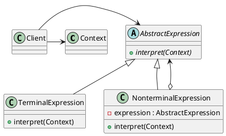

#### 7. Participants（参加者）

* **AbstractExpression:** 構文木のすべてのノードに共通する `interpret` 操作を宣言するインターフェース。
* **TerminalExpression:** 文法の終端記号（変数や数値など、それ以上分解できない要素）の解釈を実装。
* **NonterminalExpression:** 文法の規則（加算、論理積など、他の式を組み合わせる要素）を実装。
* **Context:** インタープリタが解釈を行うために必要なグローバルな情報（変数の値など）を保持。
* **Client:** 抽象構文木を組み立て、`interpret` 操作を呼び出す。

#### 8. Collaborations（協力作用）

クライアントが構築した構文木に対して、各ノードが再帰的に `interpret` を呼び出します。非終端記号は、自分が持つ子要素の `interpret` 結果を利用して、自身の解釈結果を算出します。

#### 9. Consequences（結果）

* **メリット:** 文法の変更や拡張が容易（新しい規則をクラスとして追加するだけ）。
* **デメリット:** 文法が複雑になるとクラス数が激増し、保守が困難になる。また、再帰的な呼び出しのため実行速度は遅め。

#### 10. Implementation（実装）

* 構文木を作る「パース（解析）」部分は、このパターンの範囲外（別途実装が必要）。
* 終端記号を共有するために Flyweight パターンを併用することが多い。

#### 11. Sample Code（Java）

「変数 + 数値」を評価する例です。

```java
import java.util.Map;
import java.util.HashMap;

interface Expression {
    int interpret(Map<String, Integer> context);
}

// 終端記号（数値）
class Number implements Expression {
    private int number;
    public Number(int number) { this.number = number; }
    public int interpret(Map<String, Integer> context) { return number; }
}

// 終端記号（変数）
class Variable implements Expression {
    private String name;
    public Variable(String name) { this.name = name; }
    public int interpret(Map<String, Integer> context) {
        return context.getOrDefault(name, 0);
    }
}

// 非終端記号（足し算）
class Add implements Expression {
    private Expression left, right;
    public Add(Expression left, Expression right) { this.left = left; this.right = right; }
    public int interpret(Map<String, Integer> context) {
        return left.interpret(context) + right.interpret(context);
    }
}

public class Main {
    public static void main(String[] args) {

        // 式: x + 10
        Expression expression = new Add(new Variable("x"), new Number(10));
        
        Map<String, Integer> context = new HashMap<>();
        context.put("x", 25);
        
        System.out.println("Result: " + expression.interpret(context)); // 35
    }
}
```

#### 12. Known Uses（実例）

* 正規表現エンジン。
* SQL解析ライブラリの一部。
* 設定ファイルの独自の計算式。

#### 13. Related Patterns（関連するパターン）

* **Composite:** 構文木そのものが Composite 構造になる。
* **Flyweight:** 終端記号の共有。
* **Visitor:** 構文木に対する「操作」を分離する場合に使用。

### 16. Iterator (反復子)

#### 1. Pattern Name and Classification

* **名称：** Iterator（反復子）
* **分類：** 振る舞いに関するパターン（Behavioral）

#### 2. Intent（意図）

集合オブジェクト（リストや配列など）の内部表現を公開せずに、その要素に順次アクセスする方法を提供します。

#### 3. Also Known As（別名）

* Cursor（カーソル）

#### 4. Motivation（動機）

リスト、スタック、ツリーなど、データの保持形式は様々です。これらの中身を「順番に取り出したい」というクライアントが、データの内部構造（配列なのか連結リストなのか）を意識してループを書くと、構造が変わった時にクライアント側も修正が必要になります。Iteratorを使うことで、どんな構造であっても共通の「次へ進む」「要素を取り出す」という操作でデータを扱えます。

#### 5. Applicability（適用可能性）

* 集合オブジェクトの内部構造（実装の詳細）を隠蔽したい場合。
* 集合オブジェクトに対して、複数の異なるトラバーサル（走査）方法（順方向、逆方向など）を提供したい場合。
* 異なる種類の集合オブジェクトを、同一のインターフェースで走査したい場合。

#### 6. Structure（構造）

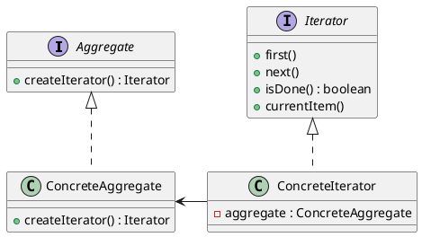

#### 7. Participants（参加者）

* **Iterator:** 要素にアクセスし、走査するためのインターフェースを定義。
* **ConcreteIterator:** 具体的な走査アルゴリズムを実装し、現在の位置を保持。
* **Aggregate:** Iteratorオブジェクトを作成するインターフェースを定義。
* **ConcreteAggregate:** Aggregateを実装し、対応するConcreteIteratorを返す。

#### 8. Collaborations（協力作用）

ConcreteIterator は ConcreteAggregate 内の要素を追跡し、次の要素を特定します。クライアントは ConcreteAggregate から Iterator を取得し、それを使って要素を順番に取得します。

#### 9. Consequences（結果）

* **メリット:** 集合オブジェクトのインターフェースをシンプルに保てる。複数の走査を同時に行える（状態をIteratorが持つため）。
* **デメリット:** 単純なリストをループするだけなら、Iteratorを介するのはオーバーヘッドになる。

#### 10. Implementation（実装）

* **外部Iterator vs 内部Iterator:** クライアントが走査を制御するのが外部Iterator（一般的）、集合側が関数を各要素に適用するのが内部Iterator。
* **堅牢なIterator:** 走査中に要素が追加・削除された際の挙動（例外を出すか、反映するか）の設計が必要。

#### 11. Sample Code（Java）

```java
import java.util.ArrayList;
import java.util.List;

interface MyIterator {
    boolean hasNext();
    Object next();
}

interface MyAggregate {
    MyIterator iterator();
}

class Book {
    private String name;
    public Book(String name) { this.name = name; }
    public String getName() { return name; }
}

class BookShelf implements MyAggregate {
    private List<Book> books = new ArrayList<>();
    public void addBook(Book book) { books.add(book); }
    public int getLength() { return books.size(); }
    public Book getBookAt(int index) { return books.get(index); }
    @Override
    public MyIterator iterator() { return new BookShelfIterator(this); }
}

class BookShelfIterator implements MyIterator {
    private BookShelf bookShelf;
    private int index = 0;
    public BookShelfIterator(BookShelf bookShelf) { this.bookShelf = bookShelf; }
    public boolean hasNext() { return index < bookShelf.getLength(); }
    public Object next() { return bookShelf.getBookAt(index++); }
}
```

#### 12. Known Uses（実例）

* `java.util.Iterator`
* C++ STL の `std::iterator`
* Python の `__iter__`, `__next__`

#### 13. Related Patterns（関連するパターン）

* **Composite:** 再帰的な構造を走査するために Iterator が使われる。
* **Factory Method:** 適切な Iterator を生成するために使われる。
* **Memento:** Iterator の現在の状態（位置）を保存するために併用されることがある。

### 17. Mediator (仲裁役)

#### 1. Pattern Name and Classification

* **名称：** Mediator（メディエータ／仲裁役）
* **分類：** 振る舞いに関するパターン（Behavioral）

#### 2. Intent（意図）

オブジェクト群の相互作用をカプセル化した「仲裁役」を定義します。オブジェクト同士が直接参照し合うことを避け、疎結合（Loose Coupling）を促進します。

#### 3. Also Known As（別名）

なし

#### 4. Motivation（動機）

GUIのダイアログボックスを想像してください。テキストボックスに入力がないと「送信ボタン」が押せない、チェックボックスを入れると別の項目が活性化するなど、部品同士が複雑に関係し合います。これらを部品間で直接通信させると、部品の再利用が困難になります。
Mediatorパターンでは、部品（Colleague）は「状態が変わった」ことを仲裁役に伝えるだけで、仲裁役（Mediator）が他の部品への影響を判断して指示を出します。

#### 5. Applicability（適用可能性）

* 多数のオブジェクトが複雑に、しかし定義された方法で相互作用しており、その相互依存関係が構造的に把握しにくくなっている場合。
* オブジェクトが他の多くのオブジェクトと通信しているために、そのオブジェクトの再利用が困難な場合。

#### 6. Structure（構造）

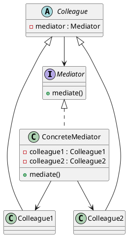

#### 7. Participants（参加者）

* **Mediator:** Colleagueオブジェクトと通信するためのインターフェース。
* **ConcreteMediator:** Colleagueたちを調整し、協調動作を具体的に実装。
* **Colleague (同僚):** 他のColleagueと直接話さず、Mediatorとだけ通信する。

#### 8. Collaborations（協力作用）

Colleagueは自分の状態が変わるとMediatorに通知します。Mediatorは、その通知を受けて影響のある他のColleagueにアクションを促します。

#### 9. Consequences（結果）

* **メリット:** サブクラス化を抑えられる。オブジェクト間の多対多の関係を、Mediatorへの一対多に整理できる。
* **デメリット:** Mediator自体が特定のアプリケーションに特化した、非常に複雑なクラス（God Object）になりやすい。

#### 10. Implementation（実装）

* 抽象Mediatorを省略することも多い。
* Observerパターンを併用して、ColleagueからMediatorへの通知を実装することが一般的。

#### 11. Sample Code（Java）

```java
interface Mediator { void colleagueChanged(); }

abstract class Colleague {
    protected Mediator mediator;
    public void setMediator(Mediator mediator) { this.mediator = mediator; }
}

class Checkbox extends Colleague {
    private boolean checked;
    public void setChecked(boolean checked) {
        this.checked = checked;
        mediator.colleagueChanged(); // 仲裁役に伝える
    }
    public boolean isChecked() { return checked; }
}

class Button extends Colleague {
    public void setEnabled(boolean enabled) {
        System.out.println("ボタン有効化: " + enabled);
    }
}

class LoginMediator implements Mediator {
    private Checkbox checkbox;
    private Button button;
    public LoginMediator(Checkbox cb, Button bt) {
        this.checkbox = cb; this.button = bt;
        cb.setMediator(this); bt.setMediator(this);
    }
    public void colleagueChanged() {
        button.setEnabled(checkbox.isChecked()); // 状態を制御
    }
}
```

#### 12. Known Uses（実例）

* GUIライブラリのフォーム制御ロジック。
* 航空管制システム（各航空機はパイロット同士ではなく管制塔と話す）。

#### 13. Related Patterns（関連するパターン）

* **Facade:** Facadeはサブシステム全体を隠蔽するが、Mediatorは通信の調整を行う。
* **Observer:** 通信の仕組みとしてObserverが使われることが多い。

### 18. Memento (形見)

#### 1. Pattern Name and Classification

* **名称：** Memento（メメント／形見）
* **分類：** 振る舞いに関するパターン（Behavioral）

#### 2. Intent（意図）

カプセル化を破壊することなく、オブジェクトの内部状態を保存し、後でその状態に戻せるようにします。

#### 3. Also Known As（別名）

* Token（トークン）

#### 4. Motivation（動機）

ゲームの「セーブ」機能や、エディタの「Undo」機能を実装する場合、オブジェクトの状態（座標、HP、テキスト内容など）をどこかに保存する必要があります。しかし、外部からこれらすべてのプライベート変数にアクセスさせるとカプセル化が壊れます。Mementoパターンでは、オブジェクト自身に「状態を詰め込んだカプセル（Memento）」を作らせ、それを外部（Caretaker）が保持します。中身は作成者以外には見えません。

#### 5. Applicability（適用可能性）

* ある時点のオブジェクトの状態（スナップショット）を保存し、後でその状態に戻す（ロールバック）必要がある場合。
* 直接状態を取得するためのインターフェースを提供すると、オブジェクトの内部構造が公開されてしまい、カプセル化が損なわれる場合。

#### 6. Structure（構造）

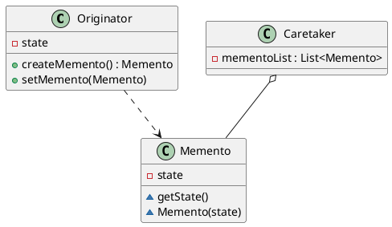

#### 7. Participants（参加者）

* **Memento:** Originatorの状態を保持するオブジェクト。Originator以外からは中身が見えないようにする（Javaではパッケージスコープや内部クラスで実現）。
* **Originator (作成者):** 現在の状態を保存したMementoを作成し、またMementoから状態を復元する。
* **Caretaker (管理人):** Mementoを保持するが、その内容を操作したり見たりすることはない。

#### 8. Collaborations（協力作用）

CaretakerはOriginatorにMementoを要求し、履歴として保管します。復元が必要なときは、保管していたMementoをOriginatorに渡して戻させます。

#### 9. Consequences（結果）

* **メリット:** カプセル化の維持。Originatorの履歴管理を外部（Caretaker）に任せられる。
* **デメリット:** 状態が巨大な場合、Mementoを頻繁に作るとメモリ消費が激しくなる。

#### 10. Implementation（実装）

* Javaでは、Mementoクラスのコンストラクタやgetterを `protected` またはパッケージプライベートにすることで、同じパッケージの Originator だけが操作できるようにする。

#### 11. Sample Code（Java）

```java
class Memento {
    private final String state;
    Memento(String state) { this.state = state; } // パッケージスコープ
    String getState() { return state; }
}

class Originator {
    private String state;
    public void setState(String state) { this.state = state; }
    public Memento save() { return new Memento(state); }
    public void restore(Memento m) { this.state = m.getState(); }
}

class Caretaker {
    private java.util.Stack<Memento> history = new java.util.Stack<>();
    public void push(Memento m) { history.push(m); }
    public Memento pop() { return history.pop(); }
}
```

#### 12. Known Uses（実例）

* テキストエディタの「元に戻す（Undo）」機能。
* データベースのトランザクション管理（ロールバック）。

#### 13. Related Patterns（関連するパターン）

* **Command:** Undo可能な命令を実現するために Memento を使う。
* **Iterator:** 走査状態の保存に Memento が使われることがある。

### 19. Observer (観察者)

#### 1. Pattern Name and Classification

* **名称：** Observer（オブザーバー／観察者）
* **分類：** 振る舞いに関するパターン（Behavioral）

#### 2. Intent（意図）

オブジェクト間に「一対多」の依存関係を定義し、あるオブジェクト（Subject）の状態が変化したときに、依存しているすべてのオブジェクト（Observer）に自動的に通知・更新が行われるようにします。

#### 3. Also Known As（別名）

* Dependents（依存者）
* Publish-Subscribe (出版-購読)

#### 4. Motivation（動機）

株価チャートのシステムを考えます。「株価データ」が更新されたとき、それを元に「折れ線グラフ」「数値一覧表」「アラート通知」のすべてを同時に更新する必要があります。データ側がグラフや表のクラスをすべて知っていると結合が強すぎます。そこで、グラフや表を「観察者」として登録させ、データが変わった瞬間に一斉に「更新してください」という通知を送るようにします。

#### 5. Applicability（適用可能性）

* 一つのオブジェクトの変更が他の
複数のオブジェクトに波及する必要があるが、それらのオブジェクトが誰であるかを固定したくない場合。
* 抽象化された2つの側面（SubjectとObserver）があり、一方が他方に依存しているが、それぞれを独立に再利用・拡張したい場合。

#### 6. Structure（構造）

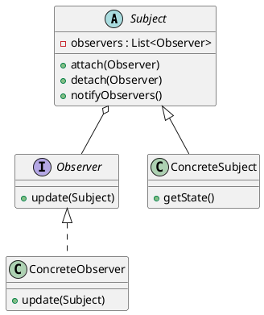

#### 7. Participants（参加者）

* **Subject (被験者):** Observerたちを登録・削除する機能を持ち、通知を送る。
* **Observer (観察者):** Subjectからの通知を受け取るための更新インターフェース。
* **ConcreteSubject:** 具体的な状態を保持。
* **ConcreteObserver:** 具体的な更新処理を実装。

#### 8. Collaborations（協力作用）

Subjectは自分の状態が変わると `notifyObservers()` を呼び、登録されている全Observerの `update()` メソッドを呼び出します。

#### 9. Consequences（結果）

* **メリット:** SubjectとObserverの抽象的な結合。放送型の通信が可能。
* **デメリット:** Observerが大量にある場合、予期せぬ更新の連鎖（性能低下）が発生することがある。誰がなぜ通知を送ったのかが追いにくい。

#### 10. Implementation指標

* **Pushモデル:** Subjectが情報を引数で送る。
* **Pullモデル:** Subjectが「変わったよ」とだけ伝え、Observerが詳細を自分から取りに行く（柔軟だが依存度は高い）。

#### 11. Sample Code（Java）

```java
interface Observer { void update(int price); }

class StockData {
    private List<Observer> observers = new ArrayList<>();
    public void addObserver(Observer o) { observers.add(o); }
    public void setPrice(int price) {
        for (Observer o : observers) o.update(price);
    }
}

class Display implements Observer {
    public void update(int price) {
        System.out.println("現在の株価を表示: " + price);
    }
}
```

#### 12. Known Uses（実例）

* GUIのイベントリスナー（`ActionListener`等）。
* MVCアーキテクチャ（ModelがSubject、ViewがObserver）。
* RxJavaなどのリアクティブプログラミング。

#### 13. Related Patterns（関連するパターン）

* **Mediator:** 複雑な更新関係を調整するために仲介役を置く場合がある。
* **Singleton:** Subjectは1つであることが多いため併用される。

### 20. State (状態)

#### 1. Pattern Name and Classification

* **名称：** State（ステート／状態）
* **分類：** 振る舞いに関するパターン（Behavioral）

#### 2. Intent（意図）

オブジェクトの内部状態が変化したときに、そのオブジェクトが振る舞いを変えられるようにします。クラスがそのクラス自体を切り替えたかのように見えます。

#### 3. Also Known As（別名）

* Objects for States（状態のためのオブジェクト）

#### 4. Motivation（動機）

金庫（Vault）のシステムを考えます。「通常状態」ではダイヤルを回すと金庫が開きますが、「警戒状態」ではダイヤルを回すと警報が鳴ります。
これを一つのクラスで書くと、すべてのメソッド（ダイヤルを回す、金庫を叩く等）の中に `if (state == NORMAL) ... else if (state == ALARM) ...` という巨大な条件分岐が発生します。
Stateパターンでは、各状態（通常、警戒、非常事態）を個別のクラスとして独立させ、金庫クラスはその状態オブジェクトに処理を丸投げ（委譲）します。

#### 5. Applicability（適用可能性）

* オブジェクトの振る舞いがその状態に依存しており、実行時に状態に応じて振る舞いを変える必要がある場合。
* 状態によって変わる多重の条件分岐（ifやswitch）が、コードのあちこちに散在している場合。

#### 6. Structure（構造）

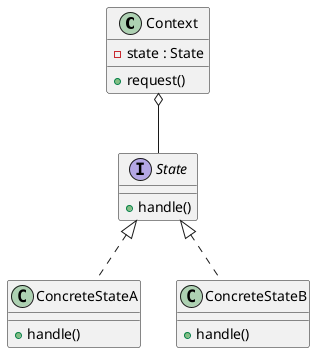

#### 7. Participants（参加者）

* **Context:** 現在の状態を表すConcreteStateのインスタンスを保持する。
* **State:** 状態ごとの振る舞いをカプセル化するためのインターフェース。
* **ConcreteState:** 特定の状態における振る舞いを具体的に実装。

#### 8. Collaborations（協力作用）

Contextは受け取ったリクエストを現在保持しているStateオブジェクトに転送します。状態の遷移（次の状態への切り替え）は、ConcreteStateが行う場合と、Contextが行う場合があります。

#### 9. Consequences（結果）

* **メリット:** 状態固有の振る舞いを局所化できる。巨大な条件分岐を排除できる。状態遷移を明示的に表現できる。
* **デメリット:** 状態の数だけクラスが増える。

#### 10. Implementation（実装）

* 状態オブジェクトをシングルトン（Singleton）にして共有することで、メモリ消費を抑えることが多い。

#### 11. Sample Code（Java）

```java
interface State { void doAction(Context context); }

class Context {
    private State state;
    public void setState(State state) { this.state = state; }
    public void request() { state.doAction(this); }
}

class DayState implements State {
    public void doAction(Context context) {
        System.out.println("昼間の動作: 電灯を消します");
        // 条件により夜状態へ遷移
    }
}
```

#### 12. Known Uses（実例）

* TCP接続の状態管理（Established, Listening, Closed等）。
* ゲームキャラクターの状態（待機、走行、攻撃、ダメージ）。

#### 13. Related Patterns（関連するパターン）

* **Flyweight:** 状態オブジェクトを共有する場合。
* **Strategy:** 構造は似ているが、Strategyは「手法の切り替え」であり、Stateは「状態の変化による挙動の変化」を目的とする。

### 21. Strategy (戦略)

#### 1. Pattern Name and Classification

* **名称：** Strategy（ストラテジー／戦略）
* **分類：** 振る舞いに関するパターン（Behavioral）

#### 2. Intent（意図）

一連のアルゴリズムを定義し、それぞれをカプセル化して、それらを交換可能にします。Strategyパターンにより、アルゴリズムをそれを利用するクライアントから独立して変化させることができます。

#### 3. Also Known As（別名）

* Policy（ポリシー）

#### 4. Motivation（動機）

文章の並べ替え（ソート）機能を考えます。「クイックソート」「マージソート」「バブルソート」など、複数の手法があり、状況（データの量やメモリ制限）によって使い分けたいとします。
これらを一つのクラスに書くのではなく、各ソート手法を「戦略（Strategy）」として独立させ、実行時に必要な戦略を選択して差し替えることで、プログラムの柔軟性を高めます。

#### 5. Applicability（適用可能性）

* 関連する多くのクラスが、振る舞いにおいてのみ異なる場合。
* アルゴリズムの異なる変種（スピード重視、メモリ節約重視など）が必要な場合。
* アルゴリズムが、クライアントが知るべきではないデータを使用している場合（隠蔽）。

#### 6. Structure（構造）

```plantuml
@startuml
class Context {
    - strategy : Strategy
    + contextInterface()
}
interface Strategy {
    + algorithmInterface()
}
class ConcreteStrategyA {
    + algorithmInterface()
}
class ConcreteStrategyB {
    + algorithmInterface()
}
Context o-- Strategy
Strategy <|.. ConcreteStrategyA
Strategy <|.. ConcreteStrategyB
@enduml
```

#### 7. Participants（参加者）

* **Strategy:** サポートするすべてのアルゴリズムに共通のインターフェース。
* **ConcreteStrategy:** Strategyインターフェースを実際に実装。
* **Context:** ConcreteStrategyのインスタンスで構成され、Strategyへの参照を保持。

#### 8. Collaborations（協力作用）

ContextとStrategyが対話してアルゴリズムを実行します。Contextは、アルゴリズムに必要なデータをStrategyに渡したり、自分自身を渡してStrategyからアクセスさせたりします。

#### 9. Consequences（結果）

* **メリット:** アルゴリズムの継承による再利用。条件分岐（switch）の除去。実行時にアルゴリズムを動的に変更可能。
* **デメリット:** クライアントが適切なStrategyを選ぶために、各Strategyの違いを理解していなければならない。

#### 10. Implementation（実装）

* Java 8以降であれば、単純なアルゴリズムはラムダ式を用いてStrategyを渡すことができる。

#### 11. Sample Code（Java）

```java
interface Strategy { int compute(int a, int b); }

class AddStrategy implements Strategy {
    public int compute(int a, int b) { return a + b; }
}

class Context {
    private Strategy strategy;
    public Context(Strategy strategy) { this.strategy = strategy; }
    public int execute(int a, int b) { return strategy.compute(a, b); }
}
```

#### 12. Known Uses（実例）

* `java.util.Comparator`（ソート順序の戦略）。
* レイアウトマネージャー（GUIの部品配置戦略）。

#### 13. Related Patterns（関連するパターン）

* **State:** 構造は酷似しているが、目的が「アルゴリズムの選択」か「状態による変化」かで異なる。

---

### 22. Template Method (テンプレートの型)

#### 1. Pattern Name and Classification

* **名称：** Template Method（テンプレートメソッド）
* **分類：** 振る舞いに関するパターン（Behavioral）

#### 2. Intent（意図）

操作におけるアルゴリズムの骨組みを定義し、一部の手順をサブクラスに委ねます。Template Methodにより、サブクラスはアルゴリズムの構造を変えることなく、その特定のステップを再定義できます。

#### 3. Also Known As（別名）

なし

#### 4. Motivation（動機）

「料理を作る」という共通の手順があるとします。「材料を切る」→「加熱する」→「盛り付ける」という大枠の流れはどの料理でも同じです。
しかし、具体的な「加熱する方法（焼く、煮る）」や「具材」は料理によって違います。親クラスで「料理の手順（テンプレート）」を固定し、具体的な中身（メソッドの実装）だけを子クラスに任せることで、手順の重複を避け、全体の流れを統一できます。

#### 5. Applicability（適用可能性）

* アルゴリズムの不変な部分を一度だけ実装し、変化する部分をサブクラスで実装させたい場合。
* サブクラス間の共通の振る舞いを抽出し、コードの重複を避けたい場合。
* サブクラスによる拡張を、特定のステップ（フック）だけに限定したい場合。

#### 6. Structure（構造）

```plantuml
@startuml
abstract class AbstractClass {
    + templateMethod()
    + {abstract} primitiveOperation1()
    + {abstract} primitiveOperation2()
}
class ConcreteClass {
    + primitiveOperation1()
    + primitiveOperation2()
}
AbstractClass <|-- ConcreteClass
@enduml
```

#### 7. Participants（参加者）

* **AbstractClass:** アルゴリズムの骨組みとなる `templateMethod` を持つ。具体的なステップとなる抽象メソッドを定義。
* **ConcreteClass:** 抽象メソッドを実装し、アルゴリズムの特定のステップを完成させる。

#### 8. Collaborations（協力作用）

ConcreteClass は、AbstractClass が定義したアルゴリズムの「構造」に従って動作します。

#### 9. Consequences（結果）

* **メリット:** コードの再利用性が高い。「ハリウッドの原則」（Don't call us, we'll call you: 親が子を呼ぶ）を実現。
* **デメリット:** アルゴリズムの枠組みを親で固定するため、全体の流れを大きく変える柔軟性は低い。

#### 10. Implementation（実装）

* 親クラスのメソッドは、サブクラスで勝手に書き換えられないよう `final` にすることが推奨される。
* 何もしない「空のメソッド（フック）」を用意し、必要なサブクラスだけが上書きできるようにすることもある。

#### 11. Sample Code（Java）

```java
abstract class Game {
    abstract void initialize();
    abstract void startPlay();
    abstract void endPlay();

    // これが Template Method
    public final void play() {
        initialize();
        startPlay();
        endPlay();
    }
}

class Soccer extends Game {
    void initialize() { System.out.println("サッカーゲーム初期化"); }
    void startPlay() { System.out.println("キックオフ！"); }
    void endPlay() { System.out.println("試合終了"); }
}
```

#### 12. Known Uses（実例）

* `java.util.AbstractList` などの抽象コレクション。
* JUnit の `setUp()`, `tearDown()`（古いバージョン）。

#### 13. Related Patterns（関連するパターン）

* **Strategy:** Strategyは委譲（Delegation）を使い、Template Methodは継承（Inheritance）を使う。
* **Factory Method:** Template Methodの中でインスタンス生成ステップを抽象化すると、Factory Methodになる。

### 23. Visitor (訪問者)

#### 1. Pattern Name and Classification

* **名称：** Visitor（ビジター／訪問者）
* **分類：** 振る舞いに関するパターン（Behavioral）

#### 2. Intent（意図）

あるオブジェクト構造の要素に対して実行される操作を表現します。Visitorにより、操作対象となる要素のクラスを変更せずに、新しい操作を定義できます。

#### 3. Also Known As（別名）

なし

#### 4. Motivation（動機）

ファイルシステム（Composite構造）に対して、「ファイル名の検索」「合計サイズの計算」「全ファイルの圧縮」など、次々と新しい処理を追加したいとします。
もし、新しい処理が必要になるたびに「ファイル」や「フォルダ」のクラスにメソッドを追加していたら、クラスがどんどん肥大化します。
Visitorパターンでは、データ構造を巡回する「訪問者（Visitor）」を定義します。データ側は `accept(visitor)` という窓口だけを用意し、実際の処理（検索、計算、圧縮）はVisitorクラス側に記述します。

#### 5. Applicability（適用可能性）

* 多くの異なるインターフェースを持つクラスからなるオブジェクト構造があり、それらに対して各クラスに依存した操作を行いたい場合。
* データ構造は安定しているが、その上の操作が頻繁に追加・変更される場合。

#### 6. Structure（構造）

```plantuml
@startuml
interface Visitor {
    + visitConcreteElementA(ConcreteElementA)
    + visitConcreteElementB(ConcreteElementB)
}
interface Element {
    + accept(Visitor)
}
class ConcreteElementA {
    + accept(Visitor)
}
class ConcreteElementB {
    + accept(Visitor)
}
class ConcreteVisitor {
    + visitConcreteElementA()
    + visitConcreteElementB()
}
Visitor <|.. ConcreteVisitor
Element <|.. ConcreteElementA
Element <|.. ConcreteElementB
ConcreteElementA <-- ConcreteVisitor
ConcreteElementB <-- ConcreteVisitor
@enduml
```

#### 7. Participants（参加者）

* **Visitor:** 各Elementクラスに対応する `visit` メソッドを宣言。
* **ConcreteVisitor:** 各 `visit` メソッドの具体的な処理を実装。
* **Element:** Visitorを引数として受け取る `accept` メソッドを定義。
* **ConcreteElement:** `accept` メソッドを実装。内部で `visitor.visit(this)` を呼ぶ。
* **ObjectStructure:** Elementの集合（リストや木構造）を保持し、Visitorを巡回させる。

#### 8. Collaborations（協力作用）

ダブルディスパッチという手法を使います。

1. クライアントが Element の `accept(visitor)` を呼ぶ。
2. Element は渡された visitor の `visit(this)` を呼ぶ。
3. Visitor は自分の型と Element の型の両方を知ることができ、適切な処理を実行する。

#### 9. Consequences（結果）

* **メリット:** データ構造と操作の分離。新しい操作（Visitor）の追加が非常に容易。
* **デメリット:** データ構造側のクラス（Element）を新しく追加するのが非常に困難（すべてのVisitorを修正する必要があるため）。

#### 10. Implementation（実装）

* 各要素を再帰的に巡回するロジックは、ObjectStructure（リストなど）が持つ場合と、Visitorが持つ場合があります。

#### 11. Sample Code（Java）

```java
interface Visitor {
    void visit(File file);
    void visit(Directory dir);
}

interface Element { void accept(Visitor visitor); }

class File implements Element {
    public void accept(Visitor v) { v.visit(this); }
}

class SizeVisitor implements Visitor {
    private int totalSize = 0;
    public void visit(File f) { totalSize += 100; /* 例 */ }
    public void visit(Directory d) { /* ディレクトリ内の要素へ */ }
}
```

#### 12. Known Uses（実例）

* コンパイラの構文解析木に対する最適化、コード生成処理。
* 静的解析ツール。

#### 13. Related Patterns（関連するパターン）

* **Composite:** Visitor は Composite 構造の上で動作することが多い。
* **Interpreter:** 文法を解釈した後の構文木に対する操作に Visitor が使われる。
